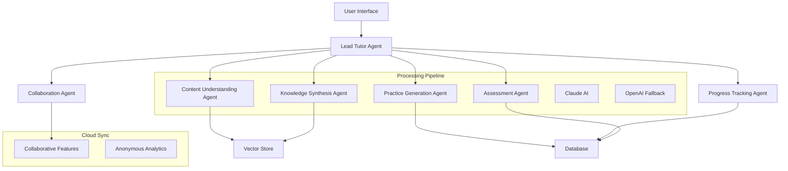

# AI Study Architect - System Architecture

---
Document Level: 3
Created: July 2025
Last Updated: August 2025
Supersedes: None
Status: Active
---

## Overview

AI Study Architect is a **7-agent learning system** that leverages Claude best practices for development and deployment. The system creates personalized, adaptive study experiences through orchestrated AI agents working in concert to solve the **AI Learning Paradox**: **86% of students use AI in their studies, yet research shows they perform worse when AI support is removed - creating cognitive debt instead of cognitive strength**.

### The Seven Specialized Agents
1. **Lead Tutor Agent** - Orchestrates the learning experience ✅ LIVE
2. **Content Understanding Agent** - Processes any educational material ✅ LIVE
3. **Knowledge Synthesis Agent** - Creates personalized connections ✅ LIVE
4. **Practice Generation Agent** - Builds exercises targeting learning opportunities ✅ LIVE
5. **Progress Tracking Agent** - Monitors true understanding ✅ LIVE
6. **Assessment Agent** - Evaluates comprehension, not correctness ✅ LIVE
7. **Collaboration Agent** - Enables collective intelligence ✅ LIVE

## Architecture Principles

### 1. Multi-Agent Design Pattern
- **Separation of Concerns**: Each agent has a single, well-defined responsibility
- **Loose Coupling**: Agents communicate through standardized message interfaces
- **High Cohesion**: Related functionality is grouped within agents
- **Testability**: Each agent can be tested in isolation

### 2. Understanding-First Architecture
- **Learning Focus**: All decisions optimize for comprehension, not convenience
- **User Control**: Flexible processing options based on user needs
- **Data Minimization**: Only essential data stored for learning continuity
- **Secure Implementation**: Standard security practices throughout

### 3. Claude Development Patterns
- **Explore-Plan-Code-Test**: Standard workflow for all features
- **Test-Driven Development**: Tests written before implementation
- **Iterative Refinement**: 2-3 iterations for optimal results
- **Multi-Instance Verification**: Separate Claude instances for code review

## System Components

### Backend Architecture (FastAPI + Python)

```
backend/
├── app/
│   ├── main.py                    # FastAPI application entry
│   ├── api/                       # REST API endpoints
│   │   ├── v1/
│   │   │   ├── auth.py           # Authentication endpoints
│   │   │   ├── content.py        # Content management
│   │   │   ├── study.py          # Study session management
│   │   │   └── practice.py       # Practice generation
│   │   └── dependencies.py       # Shared dependencies
│   ├── agents/                   # Multi-agent system
│   │   ├── base.py              # Base agent class
│   │   ├── lead_tutor.py        # Orchestration agent ✅ Live
│   │   ├── content_understanding.py  # Processes educational materials ✅ Live
│   │   ├── knowledge_synthesis.py    # Creates connections between concepts ✅ Live
│   │   ├── practice_generation.py    # Develops custom exercises ✅ Live
│   │   ├── progress_tracking.py      # Monitors learning patterns ✅ Live
│   │   ├── assessment.py             # Evaluates true comprehension ✅ Live
│   │   └── collaboration.py          # Enables collective intelligence ✅ Live
│   ├── core/                    # Core functionality
│   │   ├── config.py           # Configuration management
│   │   ├── security.py         # JWT, password hashing
│   │   └── database.py         # Database connections
│   ├── models/                 # SQLAlchemy models
│   │   ├── user.py
│   │   ├── content.py
│   │   ├── study_session.py
│   │   └── practice.py
│   ├── schemas/                # Pydantic schemas
│   │   └── ...                 # Request/response models
│   └── services/              # Business logic
│       ├── ai_service_manager.py  # Intelligent AI service selection (Claude → OpenAI)
│       ├── claude_service.py      # Anthropic Claude integration (primary)
│       ├── openai_service.py      # OpenAI fallback service
│       ├── content_processor.py   # File processing pipeline
│       └── ...
├── tests/                     # Test suite
│   ├── unit/
│   ├── integration/
│   └── e2e/
└── alembic/                  # Database migrations
```

### Frontend Architecture (React + TypeScript)

```
frontend/
├── src/
│   ├── components/          # React components
│   │   ├── common/         # Shared components
│   │   ├── auth/          # Authentication UI
│   │   ├── study/         # Study session UI
│   │   ├── content/       # Content management UI
│   │   └── practice/      # Practice interface
│   ├── hooks/             # Custom React hooks
│   ├── services/          # API client services
│   ├── store/            # State management
│   ├── types/            # TypeScript types
│   └── utils/            # Utility functions
├── public/               # Static assets
└── tests/               # Frontend tests
```

### AI/ML Components

```
ml/
├── agents/              # Agent implementations
├── prompts/            # Prompt templates
├── evaluation/         # Performance metrics
└── models/            # Model configurations
```

## Agent Communication Flow



## Data Flow Architecture

### 1. Content Processing Pipeline
```
User Upload → Content Understanding Agent → Embeddings → Vector Store
                    ↓
              Text Extraction
                    ↓
              Concept Mapping
                    ↓
              Knowledge Graph
```

### 2. Study Session Flow
```
User Request → Lead Tutor → Knowledge Synthesis → Personalized Content
                   ↓                                      ↓
            Progress Tracking ← User Interaction ← Interactive Session
```

### 3. Practice Generation Flow
```
Learning Objectives → Practice Generation Agent → Problem Set
                            ↓                          ↓
                    Difficulty Calibration      User Attempts
                            ↓                          ↓
                    Adaptive Adjustment ← Performance Analysis
```

## Security Architecture

### Authentication & Authorization
- **JWT-based authentication** with refresh tokens
- **Role-based access control** (Student, Educator, Admin)
- **Session management** with secure storage
- **OAuth2 integration** for social logins

### Data Security
- **Encryption at rest** for sensitive data
- **TLS 1.3** for data in transit
- **Input validation** and sanitization
- **Rate limiting** on all endpoints

### Data Controls
- **User-controlled processing** for personal data
- **Opt-in data sharing** for collaborative features
- **Data retention policies** with automatic cleanup
- **Export and deletion** capabilities

## Performance Optimization

### Backend Optimizations
- **Async/await patterns** throughout
- **Connection pooling** for database
- **Redis caching** for AI responses
- **Batch processing** for embeddings
- **Lazy loading** for large datasets

### Frontend Optimizations
- **Code splitting** and lazy imports
- **React.memo** for expensive components
- **Virtual scrolling** for long lists
- **Optimistic UI updates**
- **Service worker** for offline support

### AI/ML Optimizations
- **Model quantization** for faster inference
- **Embedding cache** with TTL
- **Batch inference** for multiple requests
- **Vector index optimization**
- **Prompt template caching**

## Deployment Architecture

### Development Environment
```yaml
services:
  backend:
    - FastAPI with hot reload
    - Local PostgreSQL
    - Local Redis
    - Claude + OpenAI APIs for AI
    
  frontend:
    - Vite dev server
    - React Fast Refresh
    
  infrastructure:
    - Docker Compose
    - Vector database
```

### Production Environment
```yaml
services:
  backend:
    - FastAPI with Gunicorn
    - PostgreSQL cluster
    - Redis cluster
    - Load balancer
    
  frontend:
    - CDN distribution
    - Static hosting
    
  infrastructure:
    - Kubernetes
    - Horizontal pod autoscaling
    - Monitoring (Prometheus/Grafana)
```

## Monitoring & Observability

### Metrics Collection
- **Application metrics**: Response times, error rates
- **AI metrics**: Inference times, token usage
- **Business metrics**: User engagement, learning outcomes
- **Infrastructure metrics**: CPU, memory, disk usage

### Logging Strategy
- **Structured logging** with correlation IDs
- **Log aggregation** with ELK stack
- **Error tracking** with Sentry
- **Audit logs** for compliance

### Distributed Tracing
- **OpenTelemetry** instrumentation
- **Trace context propagation**
- **Performance bottleneck identification**
- **User journey tracking**

## Development Workflow

### 1. Feature Development
```bash
# 1. Create feature branch
git worktree add ../project-feature-x feature-x

# 2. Write tests first (TDD)
# Use /project:setup-testing command

# 3. Implement feature
# Use /project:create-agent or /project:implement-ui-component

# 4. Verify with tests
pytest backend/tests/ -v
npm test

# 5. Run linters
ruff check backend/ && npm run lint

# 6. Create PR
gh pr create
```

### 2. Agent Development Workflow
```bash
# 1. Define agent responsibility
# Think about inputs, outputs, and interactions

# 2. Write agent tests
# Use /project:create-agent command

# 3. Implement agent logic
# Follow patterns in lead_tutor.py

# 4. Test agent interactions
# Use separate Claude instance for verification

# 5. Integration testing
# Test with other agents in system
```

### 3. UI Development Workflow
```bash
# 1. Get design mockup
# Request from designer or create wireframe

# 2. Write component tests
# Use /project:implement-ui-component

# 3. Implement component
# Follow Material-UI patterns

# 4. Visual verification
# Take screenshots and compare

# 5. Iterate 2-3 times
# Refine based on visual feedback
```

## Best Practices Summary

1. **Always use TDD**: Write tests before implementation
2. **Explore before coding**: Read existing code to understand patterns
3. **Plan complex features**: Use "think" commands for architecture decisions
4. **Iterate on UI**: 2-3 iterations for best visual results
5. **Verify with subagents**: Use separate instances for code review
6. **Clear context regularly**: Use /clear between unrelated tasks
7. **Document decisions**: Update CLAUDE.md with learnings
8. **Performance first**: Profile and optimize early
9. **Security by default**: Validate all inputs, encrypt sensitive data
10. **User control**: Flexible processing options for different needs