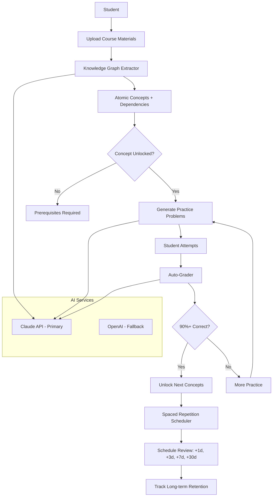

# AI Study Architect - System Architecture

---
Document Level: 3
Created: July 2025
Last Updated: October 2025
Supersedes: None
Status: Active - Strategic Pivot to Mastery-Based Learning
---

## Overview

AI Study Architect is a **mastery-based learning system** that proves students actually learned through knowledge graphs, spaced repetition, and measurable retention. Currently focused on CS education (CS50) as beachhead market. The system solves the **AI Learning Paradox**: **86% of students use AI in their studies, yet research shows they perform worse when AI support is removed - creating cognitive debt instead of cognitive strength**.

**Strategic Direction**: See [NEW_DIRECTION_2025.md](NEW_DIRECTION_2025.md) for complete pivot rationale and roadmap.

### Current Implementation (October 2025)

**What's Live:**
- Lead Tutor Agent - Provides Socratic questioning and explanations
- File upload and content processing
- Chat interface with streaming responses
- User authentication and session management

**In Active Development** (see [DAILY_DEV_PLAN.md](../DAILY_DEV_PLAN.md)):
1. **Knowledge Graph Extractor** - Extract atomic concepts and dependencies from course materials
2. **Practice Problem Generator** - Create auto-graded programming exercises
3. **Mastery Tracker** - Enforce 90%+ gates before concept unlock
4. **Spaced Repetition Scheduler** - SM-2 algorithm for optimal review timing
5. **Retention Analyzer** - Track long-term learning (weeks/months later)

### Legacy Architecture Note

The original vision included a "7-agent system" (Lead Tutor, Content Understanding, Knowledge Synthesis, Practice Generation, Progress Tracking, Assessment, Collaboration). After strategic analysis, we pivoted to focus on measurable mastery-based learning outcomes instead of agent count. See [DOCUMENTATION_AUDIT.md](../DOCUMENTATION_AUDIT.md) for details on the transition.

## Architecture Principles

### 1. Mastery-Based Learning Design
- **Measurable Outcomes**: All features optimized for retention, not just completion
- **Knowledge Graph Structure**: Concepts are atomic and dependencies explicit
- **Mastery Gates**: Students must prove understanding (90%+) before advancing
- **Spaced Repetition**: Review timing based on cognitive science (SM-2 algorithm)
- **Long-term Tracking**: Measure learning weeks/months later, not just immediately

### 2. Service-Oriented Architecture
- **Separation of Concerns**: Each service has a single, well-defined responsibility
- **Loose Coupling**: Services communicate through database and API interfaces
- **High Cohesion**: Related functionality is grouped within services
- **Testability**: Each service can be tested in isolation

### 3. Understanding-First Development
- **Learning Focus**: All decisions optimize for comprehension, not convenience
- **Incremental Implementation**: Daily 1-2 hour sessions with clear wins (see DAILY_DEV_PLAN.md)
- **Data Minimization**: Only essential data stored for learning continuity
- **Secure Implementation**: Standard security practices throughout

### 4. Development Workflow
- **Test-Driven Development**: Tests written before implementation
- **Iterative Refinement**: Validate with real CS50 materials, iterate based on results
- **Code Review**: PR reviews via automated Claude bot
- **Daily Progress**: Small wins compound over time

## System Components

### Backend Architecture (FastAPI + Python)

```
backend/
├── app/
│   ├── main.py                    # FastAPI application entry
│   ├── api/                       # REST API endpoints
│   │   ├── v1/
│   │   │   ├── auth.py           # Authentication endpoints
│   │   │   ├── content.py        # Content management
│   │   │   ├── study.py          # Study session management
│   │   │   └── practice.py       # Practice generation
│   │   └── dependencies.py       # Shared dependencies
│   ├── agents/                   # Agent system (current)
│   │   ├── base.py              # Base agent class ✅ Live
│   │   └── lead_tutor.py        # Socratic questioning agent ✅ Live
│   ├── core/                    # Core functionality
│   │   ├── config.py           # Configuration management
│   │   ├── security.py         # JWT, password hashing
│   │   └── database.py         # Database connections
│   ├── models/                 # SQLAlchemy models
│   │   ├── user.py            # User accounts ✅ Live
│   │   ├── content.py         # Uploaded materials ✅ Live
│   │   ├── study_session.py   # Learning sessions ✅ Live
│   │   ├── practice.py        # Practice problems ✅ Live
│   │   ├── concept.py         # Knowledge graph concepts [PLANNED - Week 1-2]
│   │   ├── user_attempt.py    # Problem-solving attempts [PLANNED - Week 3-4]
│   │   └── mastery_status.py  # Mastery tracking [PLANNED - Week 5-6]
│   ├── schemas/                # Pydantic schemas
│   │   └── ...                 # Request/response models
│   └── services/              # Business logic
│       ├── ai_service_manager.py        # AI service selection (Claude → OpenAI) ✅ Live
│       ├── claude_service.py            # Anthropic Claude integration ✅ Live
│       ├── openai_fallback.py           # OpenAI fallback service ✅ Live
│       ├── content_processor.py         # File processing pipeline ✅ Live
│       ├── knowledge_graph_service.py   # Concept extraction [PLANNED - Week 1]
│       ├── practice_generator.py        # Problem generation [PLANNED - Week 3]
│       ├── mastery_tracker.py           # Mastery gates [PLANNED - Week 5]
│       ├── spaced_repetition.py         # SM-2 scheduling [PLANNED - Week 6]
│       └── auto_grader.py               # Code execution sandbox [PLANNED - Week 4]
├── tests/                     # Test suite
│   ├── unit/
│   ├── integration/
│   └── e2e/
└── alembic/                  # Database migrations
```

### Frontend Architecture (React + TypeScript)

```
frontend/
├── src/
│   ├── components/          # React components
│   │   ├── common/         # Shared components
│   │   ├── auth/          # Authentication UI
│   │   ├── study/         # Study session UI
│   │   ├── content/       # Content management UI
│   │   └── practice/      # Practice interface
│   ├── hooks/             # Custom React hooks
│   ├── services/          # API client services
│   ├── store/            # State management
│   ├── types/            # TypeScript types
│   └── utils/            # Utility functions
├── public/               # Static assets
└── tests/               # Frontend tests
```

### AI/ML Components

```
ml/
├── agents/              # Agent implementations
├── prompts/            # Prompt templates
├── evaluation/         # Performance metrics
└── models/            # Model configurations
```

## Mastery-Based Learning Flow



## Data Flow Architecture

### 1. Knowledge Graph Extraction Flow
```
Course Materials (PDF/Text) → Claude API → Atomic Concepts
                                   ↓
                          Concept Dependencies
                                   ↓
                          Database (concepts, concept_dependencies)
                                   ↓
                          Knowledge Graph Visualization
```

### 2. Practice & Mastery Flow
```
Unlocked Concept → Practice Generator → Problem + Test Cases
                            ↓
                   Student Attempts Code
                            ↓
                    Auto-Grader (sandbox)
                            ↓
                   Score ≥ 90%? → Mastery Gate
                            ↓
                    Yes: Unlock Next Concepts
                    No: Generate More Practice
```

### 3. Spaced Repetition Flow
```
Mastered Concept → Spaced Repetition Scheduler (SM-2)
                            ↓
                   Schedule Review: Day 1, Day 3, Day 7, Day 30
                            ↓
                   User Attempts Review Problem
                            ↓
                   Track Retention: Remember? Y/N
                            ↓
                   Adjust Schedule Based on Performance
```

## Security Architecture

### Authentication & Authorization
- **JWT-based authentication** with refresh tokens
- **Role-based access control** (Student, Educator, Admin)
- **Session management** with secure storage
- **OAuth2 integration** for social logins

### Data Security
- **Encryption at rest** for sensitive data
- **TLS 1.3** for data in transit
- **Input validation** and sanitization
- **Rate limiting** on all endpoints

### Data Controls
- **User-controlled processing** for personal data
- **Opt-in data sharing** for collaborative features
- **Data retention policies** with automatic cleanup
- **Export and deletion** capabilities

## Performance Optimization

### Backend Optimizations
- **Async/await patterns** throughout
- **Connection pooling** for database
- **Redis caching** for AI responses
- **Batch processing** for embeddings
- **Lazy loading** for large datasets

### Frontend Optimizations
- **Code splitting** and lazy imports
- **React.memo** for expensive components
- **Virtual scrolling** for long lists
- **Optimistic UI updates**
- **Service worker** for offline support

### AI/ML Optimizations
- **Model quantization** for faster inference
- **Embedding cache** with TTL
- **Batch inference** for multiple requests
- **Vector index optimization**
- **Prompt template caching**

## Deployment Architecture

### Development Environment
```yaml
services:
  backend:
    - FastAPI with hot reload
    - Local PostgreSQL
    - Local Redis
    - Claude + OpenAI APIs for AI
    
  frontend:
    - Vite dev server
    - React Fast Refresh
    
  infrastructure:
    - Docker Compose
    - Vector database
```

### Production Environment
```yaml
services:
  backend:
    - FastAPI with Gunicorn
    - PostgreSQL cluster
    - Redis cluster
    - Load balancer
    
  frontend:
    - CDN distribution
    - Static hosting
    
  infrastructure:
    - Kubernetes
    - Horizontal pod autoscaling
    - Monitoring (Prometheus/Grafana)
```

## Monitoring & Observability

### Metrics Collection
- **Application metrics**: Response times, error rates
- **AI metrics**: Inference times, token usage
- **Business metrics**: User engagement, learning outcomes
- **Infrastructure metrics**: CPU, memory, disk usage

### Logging Strategy
- **Structured logging** with correlation IDs
- **Log aggregation** with ELK stack
- **Error tracking** with Sentry
- **Audit logs** for compliance

### Distributed Tracing
- **OpenTelemetry** instrumentation
- **Trace context propagation**
- **Performance bottleneck identification**
- **User journey tracking**

## Development Workflow

### 1. Feature Development
```bash
# 1. Create feature branch
git worktree add ../project-feature-x feature-x

# 2. Write tests first (TDD)
# Use /project:setup-testing command

# 3. Implement feature
# Use /project:create-agent or /project:implement-ui-component

# 4. Verify with tests
pytest backend/tests/ -v
npm test

# 5. Run linters
ruff check backend/ && npm run lint

# 6. Create PR
gh pr create
```

### 2. Agent Development Workflow
```bash
# 1. Define agent responsibility
# Think about inputs, outputs, and interactions

# 2. Write agent tests
# Use /project:create-agent command

# 3. Implement agent logic
# Follow patterns in lead_tutor.py

# 4. Test agent interactions
# Use separate Claude instance for verification

# 5. Integration testing
# Test with other agents in system
```

### 3. UI Development Workflow
```bash
# 1. Get design mockup
# Request from designer or create wireframe

# 2. Write component tests
# Use /project:implement-ui-component

# 3. Implement component
# Follow Material-UI patterns

# 4. Visual verification
# Take screenshots and compare

# 5. Iterate 2-3 times
# Refine based on visual feedback
```

## Best Practices Summary

1. **Always use TDD**: Write tests before implementation
2. **Explore before coding**: Read existing code to understand patterns
3. **Plan complex features**: Use "think" commands for architecture decisions
4. **Iterate on UI**: 2-3 iterations for best visual results
5. **Verify with subagents**: Use separate instances for code review
6. **Clear context regularly**: Use /clear between unrelated tasks
7. **Document decisions**: Update CLAUDE.md with learnings
8. **Performance first**: Profile and optimize early
9. **Security by default**: Validate all inputs, encrypt sensitive data
10. **User control**: Flexible processing options for different needs