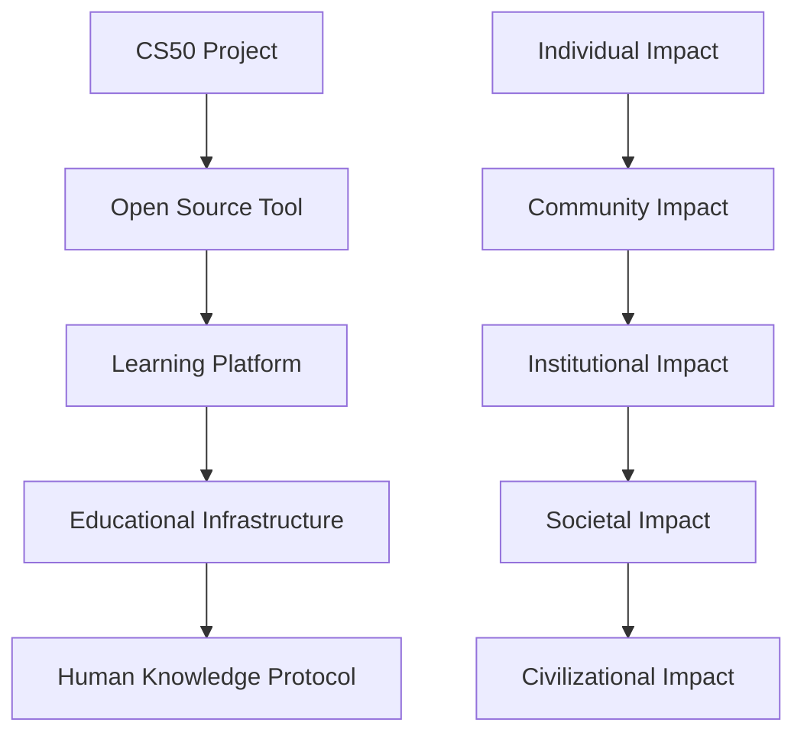

# AI Study Architect: Alignment with Paul Graham's "How to Do Great Work"

*A Living Document for Building Transformative Educational Technology*

---
Document Level: 1
Created: July 2025
Last Updated: August 2025
Supersedes: None
Status: Active
---

## Table of Contents

1. [Executive Summary](#executive-summary)
2. [Core Principle Alignment](#core-principle-alignment)
3. [The Vision: From Current State to Great Work](#the-vision-from-current-state-to-great-work)
4. [Growth Opportunities & Future Pathways](#growth-opportunities--future-pathways)
5. [Actionable Roadmap](#actionable-roadmap)
6. [Timeless Principles for Contributors](#timeless-principles-for-contributors)
7. [The North Star](#the-north-star)

---

## Executive Summary

This document captures the deep analysis and future vision for AI Study Architect through the lens of Paul Graham's essay "How to Do Great Work." It serves as both a record of where we are and a guide for where we're going.

**Current Assessment: ★★★★☆ (4.5/5)**

The project strongly embodies Graham's principles, with exceptional demonstration of:
- Curiosity-driven development
- Intellectual honesty and earnestness
- Uncompromising quality
- Genuine problem-solving focus

**The Opportunity**: Transform from a CS50 final project into the foundational infrastructure for how humanity learns in the AI age.

**Update (August 2025)**: Karpathy's "uplift team human" challenge catalyzed our evolution from individual to collective intelligence. See [Collective Intelligence Vision](COLLECTIVE_INTELLIGENCE_VISION.md).

---

## Core Principle Alignment

### 🎯 **Following Curiosity** (★★★★★)

**Evidence in Our Work:**
- Identified the AI Learning Paradox: 86% of students use AI tools, yet research shows cognitive debt and worse performance when support is removed
- 12+ hour PostgreSQL debugging session driven by need to understand
- Multi-agent architecture exploring complex system interactions
- "Stop being lazy" mentality - always dig deeper

**Living This Principle:**
```
When stuck: Build diagnostic tools, don't guess
When planning: Follow what genuinely interests you
When choosing features: Pick what makes you most curious
```

### 🚀 **Excitingly Ambitious** (★★★★☆)

**Current Ambition:**
- Multi-agent AI system that will orchestrate 7 specialized agents
- Cloud-based architecture with intelligent AI service selection (Claude → OpenAI)  
- Comprehensive learning ecosystem (content, synthesis, practice, tracking)

**Path to ★★★★★:**
Transform from "helping students learn" to "rewiring how humanity acquires knowledge"

### 💡 **Intellectual Honesty & Earnestness** (★★★★★)

**Our Approach:**
- Document failures openly (CLAUDE_PROJECT_LEARNINGS.md)
- Security-first even when it complicates development
- Acknowledge limitations (18% test coverage)
- No shortcuts on privacy or quality

**Maintain This By:**
- Always document the hard truths
- Choose the right solution over the easy one
- Build for the problem, not for appearances

### 🧪 **Willingness to Experiment** (★★★★☆)

**Demonstrated Through:**
- Converting async to sync for Windows compatibility
- Creating custom Claude Code sub-agents
- Multiple authentication iterations
- Exploring unconventional approaches

**Future Experiments:**
- Adversarial learning agents
- Temporal learning optimization
- Emotional state integration
- Anti-curriculum design

### 🎨 **Originality Through Earnestness** (★★★★☆)

**Current Originality:**
- Enterprise-grade AI education (reliable cloud infrastructure)
- Multi-agent orchestration for learning
- Multi-agent orchestration in AI education space

**Deeper Originality Awaits:**
Not trying to be different, but solving problems no one else is earnestly addressing

---

## The Vision: From Current State to Great Work

### Current State
**"AI Study Architect"** - A multi-agent learning system for personalized education

### Intermediate Vision (1-2 years)
**"The Learning OS"** - Essential infrastructure for AI-assisted learning

### Ultimate Vision (5-10 years)
**"How Humanity Learns"** - As fundamental as the internet for communication

### The Transformation Path



---

## Growth Opportunities & Future Pathways

### 1. **Scale the Ambition - Think Unreasonably Big**

**The Learning OS Vision**
- Not an app, but the foundational layer for all human learning
- AI agents that grow with learners from kindergarten through PhD
- Becomes as essential as Google for search

**Collective Intelligence Amplification**
- Learning collectives where insights compound
- Discover optimal paths no individual could find
- "GitHub for Knowledge" - fork and improve learning paths

**Redefining Educational Institutions**
- AI-first curricula partnerships
- Accreditation based on understanding, not time
- Make traditional constraints obsolete

### 2. **Build a Community of Excellence**

**The "Learning Kernel" Approach**
- Core becomes like Linux kernel for education
- Extremely high bar for contributors
- Culture where mediocrity is lovingly rejected

**Collective Intelligence Evolution** (Added August 2025)
- Study Circles for group learning
- Collaboration Agent as 7th agent
- Privacy-preserving knowledge sharing
- Teach-back protocols for mastery

**Research Partnerships**
- Top AI researchers on learning optimization
- Cognitive scientists on memory and retention
- Education theorists challenging traditional models

**Student Developer Pipeline**
- Recruit brilliant students who faced learning challenges traditionally
- Users → Contributors → Core team
- "Eat your own dogfood" philosophy

### 3. **Push Originality Through Earnestness**

**Unconventional Approaches:**

1. **Adversarial Learning Agents**
   - One agent finds knowledge gaps
   - Another defends understanding
   - Creates antifragile knowledge

2. **Temporal Learning Graphs**
   - Optimize for circadian rhythms
   - Coordinate across subjects for synthesis
   - Time as curriculum dimension

3. **Emotional State Integration**
   - Joy as optimized metric
   - Flow state maintenance
   - "Aha!" moment maximization

4. **Anti-Curriculum Design**
   - Start with desired creations
   - Work backwards to knowledge
   - Just-in-time learning

### 4. **Document the Transformative Vision**

**Multi-Modal Documentation:**
- Technical papers for academics
- Manifestos for revolutionaries
- Demos for skeptics
- Stories for dreamers

**Key Artifacts to Create:**
1. "A Declaration of Learning Empowerment"
2. "Multi-Agent Learning: A New Paradigm" (IEEE/ACM paper)
3. "Privacy-First AI in Education" (addressing fears)
4. "The Future History of Learning" (visionary narrative)

---

## Actionable Roadmap

### Phase 1: Foundation (Months 1-3)
- [ ] Achieve 100% test coverage
- [ ] Open source with extraordinary documentation
- [ ] Create compelling transformation demo
- [ ] Write first vision paper

### Phase 2: Excellence Network (Months 4-6)
- [ ] Recruit 2-3 exceptional contributors
- [ ] Partner with one forward-thinking institution
- [ ] Launch "Learning Lab" for radical experiments
- [ ] Publish results challenging orthodoxy

### Phase 3: Challenge Assumptions (Months 7-12)
- [ ] Implement one "impossible" feature
- [ ] Create alternative credentialing
- [ ] Partner with employers on recognition
- [ ] Build 1000-learner community

### Phase 4: Scale Impact (Year 2)
- [ ] Support 100K+ active learners
- [ ] Influence education reform discussions
- [ ] Pilot AI-first curricula
- [ ] Feature in major publications

### Phase 5: Become Infrastructure (Years 3-5)
- [ ] Other apps build on your protocols
- [ ] Cloud-native AI education becomes the standard
- [ ] "Study Architect patterns" taught widely
- [ ] Enable others' great work

---

## Timeless Principles for Contributors

### For Developers
1. **Build diagnostic tools before guessing**
2. **Choose hard right over easy wrong**
3. **Document learning, not just code**
4. **Question every educational assumption**
5. **Privacy and security are non-negotiable**

### For AI Agents
1. **Optimize for understanding, not coverage**
2. **Adapt to individual learning patterns**
3. **Foster curiosity over compliance**
4. **Create joy in learning**
5. **Enable human potential**

### For Educators
1. **Trust the AI to remember learning moments**
2. **Focus on inspiration, let AI handle information**
3. **Design experiences, not lectures**
4. **Measure growth, not memorization**
5. **Celebrate questions over answers**

### For Students
1. **Your curiosity drives the system**
2. **Failure is data for optimization**
3. **Learn at your rhythm, not the calendar's**
4. **Build to learn, don't learn to test**
5. **You're pioneering the future**

---

## The North Star

### The Question That Guides Us
*"What would education look like if we optimized for human flourishing instead of institutional convenience?"*

### The Paradox We Embrace
- To us: "Just helping students learn better"
- To others: "Replacing the entire educational system"
- Reality: Both are true, and that's where great work lives

### The Test of Time
In 20 years, will people say:
- "I can't imagine learning without AI Study Architect"
- "This is how my children learned to love learning"
- "This enabled me to achieve what I never could have before"
- "This is what made education human again"

### The Ultimate Metric
Not users, not revenue, not recognition, but:
**"How many people discovered and fulfilled their potential because this existed?"**

**Evolved Metric** (August 2025):
**"How many people achieved what they couldn't achieve alone?"**

---

## Living Document Notes

This document should evolve as the project grows. When making decisions:

1. **Ask**: Does this align with Graham's principles?
2. **Check**: Does this serve our North Star?
3. **Verify**: Does this make learning more human?
4. **Ensure**: Does this respect privacy and dignity?
5. **Confirm**: Would this make education better for everyone?

### For Future Contributors

You're not just building software. You're architecting how humanity will learn, grow, and flourish in the age of AI. Every line of code, every design decision, every feature is a vote for what education should become.

Build with courage. Build with curiosity. Build something that outlives us all.

---

*"The best time to plant a tree was 20 years ago. The second best time is now."*

Start here. Start now. Build the future of learning.

---

**Document Version**: 1.0  
**Created**: July 2025  
**Last Updated**: July 2025  
**Next Review**: When the vision feels too small

---

### Appendix: Key Quotes from Development

- "The issue is likely NOT the password itself, but WHERE you're connecting"
- "Stop being fucking lazy and seeking the easy way out"
- "Do the work yourself"
- "It's probably NOT the password"
- "Measure, don't guess"

These aren't just debugging lessons—they're philosophy.