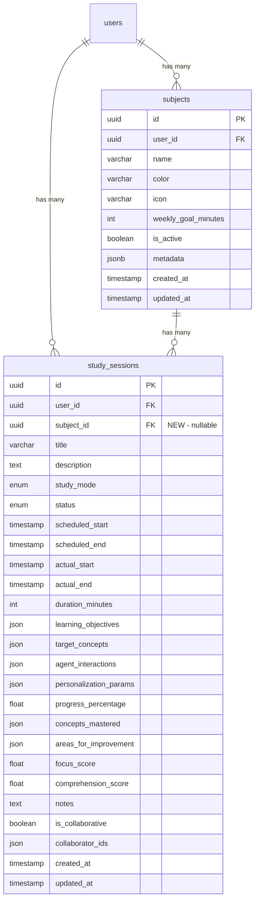

## Deepening Summary

**Deepened on:** 2026-03-14
**Agents completed:** 3 of 6 (Tailwind migration, FastAPI state machine, Dashboard aggregation)
**Agents rate-limited:** 1 (Web Worker + visx — performance review covered Worker concerns anyway)
**All reviews complete:** Security (3C/4H/5M), Performance (2 P0, 4 P1, 4 P2 findings)

### Key Improvements from Deepening

1. **Tailwind v4 + MUI cannot coexist** — atomic removal confirmed. Emotion is a hard peer dep of MUI. CSS `@layer` conflicts make parallel usage impossible. Phase 0 must remove MUI entirely before adding Tailwind.
2. **@fontsource imports MUST be in CSS** (not JS) and BEFORE `@import "tailwindcss"` with `layer(base)`. Wrong ordering breaks the font stack.
3. **Session state machine** uses optimistic locking (`version_id` column, auto-incremented by SQLAlchemy) + pessimistic lock (`SELECT FOR UPDATE`) during transitions. `sendBeacon` + `visibilitychange` for reliable browser-close detection. Heartbeat endpoint every 30s for orphan detection.
4. **Dashboard uses single consolidated query** with SQLAlchemy subqueries. Streak via SQL window function (`ROW_NUMBER() - date`). Timezone-aware grouping via `func.timezone(user_tz, column)`. Cache-aside pattern: 60s TTL per-user in Redis.
5. **`accumulated_seconds` + `pause_resume_history`** on StudySession model for accurate time tracking across pause/resume cycles (not timestamp math).

### Security Review Findings (Critical + High)

**C1 — Concurrent session race condition**: Add partial unique index to enforce one active session per user at DB level:
```sql
CREATE UNIQUE INDEX idx_one_active_session_per_user ON study_sessions (user_id) WHERE status IN ('in_progress', 'paused');
```
Application catches `IntegrityError` → returns 409. This is the ONLY reliable way to prevent dual sessions.

**C2 — State transitions must be atomic**: Use conditional UPDATE (not check-then-update):
```python
result = db.execute(update(StudySession).where(
    StudySession.id == session_id, StudySession.user_id == user_id,
    StudySession.status == SessionStatus.IN_PROGRESS
).values(status=SessionStatus.PAUSED, accumulated_seconds=new_value))
if result.rowcount == 0: raise HTTPException(409)
```

**C3 — Add `last_resumed_at` column**: The plan has `accumulated_seconds` but is missing `last_resumed_at` (DateTime, nullable). On start/resume: set `last_resumed_at = utcnow()`. On pause: `accumulated_seconds += (utcnow() - last_resumed_at).total_seconds()`, clear `last_resumed_at`.

**H2 — Timezone SQL injection risk**: NEVER interpolate `user.timezone` into raw SQL. Use parameterized: `AT TIME ZONE :tz`. Validate against `zoneinfo.available_timezones()` on user profile update.

**H4 — Move orphan cleanup out of GET**: Dashboard GET should only READ. Move orphaned session cleanup to a background task (APScheduler hourly job), not inline in the dashboard query.

**M3 — Use `fetch({keepalive: true})` not `sendBeacon()`**: `sendBeacon` can't set Authorization or CSRF headers. Use `fetch()` with `keepalive: true` for beforeunload session stop.

**M4 — SHOWSTOPPER: Production CSP blocks Web Workers**: `security_headers.py` line 183 sets `worker-src: 'none'`. The focus timer Web Worker will be SILENTLY BLOCKED in production. Fix: `worker-src: 'self' blob:` (Vite may bundle workers as blob URLs).

### Performance Review Findings (P0-P1)

**P0 — Missing composite index (CRITICAL for dashboard)**: Add to migration:
```sql
CREATE INDEX idx_study_sessions_user_status_start ON study_sessions (user_id, status, actual_start DESC);
CREATE INDEX idx_study_sessions_user_subject_start ON study_sessions (user_id, subject_id, actual_start DESC);
CREATE INDEX idx_study_sessions_user_status_active ON study_sessions (user_id, status) WHERE status IN ('in_progress', 'paused');
```
Without these, dashboard degrades to sequential scan at 500+ sessions per user.

**P0 — Dashboard should be 3 focused queries, not 1**: (1) 28-day aggregation grouped by date+subject (covers today, week, heatmap, subject breakdown in one scan), (2) active session check (partial index, instant), (3) streak: distinct study dates DESC LIMIT 365. Total <10ms with proper indexes.

**P1 — TanStack Query needs**: `refetchIntervalInBackground: false` + `staleTime: 30_000` — stops polling when tab hidden, prevents double-fetch on navigate-back.

**P1 — Timezone: compute boundaries in Python, pass UTC to WHERE**: `AT TIME ZONE` in WHERE clause prevents index usage. Compute `today_start_utc` and `window_start_utc` in Python, filter on raw `actual_start` column.

**P1 — Worker tick rate**: 100ms → 1000ms. Timer displays HH:MM:SS, not milliseconds. Reduces Worker→main messages 10x.

**P2 — Bundle**: Net JS reduction ~40-60KB (MUI removed: ~130KB, added: ~90KB). Framer Motion is 32-40KB — evaluate CSS `@starting-style` + View Transitions API as replacement. Glow filter only on active heatmap cells (not all 28).

**P2 — Zustand/TanStack sync**: Timer store should react to mutation SUCCESS, not UI events. Prevents client/server state drift on failed pause.

### Web Worker + visx Heatmap (Retry Completed)

**Web Worker in Vite 6**: Use `new URL('../timer.worker.ts', import.meta.url)` with `{ type: 'module' }`. Add `worker: { format: 'es' }` to vite.config.ts. Worker uses `setTimeout(tick, 1000)` (not setInterval) for 1s ticks. Cleanup: `worker.terminate()` in useEffect return. Zustand store subscribes to worker messages via `updateFromWorker()`.

**visx Heatmap**: `@visx/heatmap` HeatmapRect with custom bins. Color scale: `scaleLinear` from #121212 (0min) → #1a4d4f (30min) → #00a9b5 (60min) → #00F2FE (90min+). SVG glow filter (`feGaussianBlur` stdDeviation=1.5) applied ONLY to cells with 60+ minutes. `@visx/responsive` ParentSize for dynamic cell sizing. Tooltip styled with JetBrains Mono on #0a0a0a surface with #00F2FE border. Empty cells at 15% opacity.

### Simplification Review Findings

**Removed from plan (YAGNI):**
- `metadata_` JSONB on Subject — nothing reads/writes it in Phase 1
- `pause_resume_history` JSON — `accumulated_seconds` + `last_resumed_at` is the actual algorithm
- `version_id` optimistic locking — conditional UPDATE (C2 pattern) already provides atomicity
- `icon` on Subject — no UI renders it
- `framer-motion` dependency (32-40KB) — CSS `@starting-style` + `transition-delay` handles staggered card reveals; page transitions deferred
- Stub pages (SubjectDetailPage, AnalyticsPage) — create when Phase 2/5 begins
- Heartbeat endpoint — 12-hour auto-complete sufficient at current scale

**Figma integration**: Deferred. DESIGN.md → Tailwind `@theme` is the direct, timeless, tool-agnostic pattern. Figma solves a designer↔developer communication gap that doesn't exist for a solo dev. If team grows or design complexity warrants it, Figma plugs into the existing CSS variable pipeline in one session — nothing needs rebuilding. Stitch screenshots are sufficient visual references for implementation.

### Review Reconciliation (Authoritative — resolves all contradictions)

Where the plan contradicts itself across sections, THIS section is the final word:

1. **Dashboard = 3 focused queries** (NOT single query). Deepening summary line says "single consolidated query" but performance P0 correctly overrides: (1) 28-day aggregation grouped by date+subject, (2) active session check via partial index, (3) streak via distinct dates DESC. The "single DB query" language in task 1.6 is overridden.

2. **Migration ordering = install-first, remove-last**. Phase 0 steps must be: (a) install Tailwind + new deps alongside MUI (additive), (b) rewrite all MUI components to Tailwind, (c) verify build passes, (d) THEN `npm uninstall` MUI + Emotion. This keeps the codebase compilable at every step.

3. **Worker = 1000ms setTimeout** (NOT 100ms setInterval). The timer.worker.ts code in task 1.9 is overridden by the deepening research.

4. **Session stop on unload = `fetch({keepalive: true})`** (NOT sendBeacon). sendBeacon can't set auth headers. The reference in task 1.5 is overridden by security M3.

5. **No `version_id` column**. The conditional UPDATE pattern (security C2) provides atomicity. `version_id` + optimistic locking is redundant. Simplicity review confirmed: remove it.

6. **No `metadata_` JSONB, `icon`, `pause_resume_history`** on Subject/StudySession. Simplicity review: YAGNI. Only add `accumulated_seconds` (Integer) + `last_resumed_at` (DateTime nullable) to StudySession.

7. **No `framer-motion`**. CSS `@starting-style` + `transition-delay` handles Phase 1 animations.

8. **No stub pages** (SubjectDetailPage, AnalyticsPage). Don't create empty pages or dead routes. When SubjectList item is clicked, open a shadcn Dialog/Drawer showing subject info — not a separate page route.

9. **Auth dependency = `get_current_user`** (not `get_current_active_user`). Matches content.py template. `get_current_user` already checks `is_active`.

10. **Session start with no title = auto-generate**: `f"{subject.name} - {datetime.now().strftime('%b %d %H:%M')}"`. Prevents NOT NULL violation.

11. **Error code for concurrent sessions = 409** (not 400). Fix acceptance criteria.

12. **husky init from repo root** (not `frontend/`). Pre-commit hook: `cd frontend && npx lint-staged`.

13. **Partial unique index migration must be explicit** (not auto-generated):
```python
op.create_index('idx_one_active_session_per_user', 'study_sessions', ['user_id'],
    unique=True, postgresql_where=sa.text("status IN ('in_progress', 'paused')"))
```

14. **CSP fix (`worker-src: 'self' blob:'`)** is Phase 0, not deferred. Add before any Worker code.

---

# Full Product Build — Phases -1, 0, and 1

## Overview

Three phases that take Study Architect from a MUI prototype to a production-grade cyberpunk telemetry dashboard with real subject tracking, time tracking, and study session management. Each phase ships complete, testable functionality — no partial work.

- **Phase -1**: Generate evolved Stitch designs + set up Figma token governance
- **Phase 0**: Frontend foundation (Tailwind v4 + shadcn/ui + quality tooling)
- **Phase 1**: Subjects + time tracking (backend APIs + dashboard + focus session)

**Origin brainstorm**: [docs/brainstorms/2026-03-13-mvp-frontend-brainstorm.md](../brainstorms/2026-03-13-mvp-frontend-brainstorm.md) — all technology decisions, product decisions, and research citations are there. This plan covers HOW to implement what the brainstorm decided.

---

## Problem Statement / Motivation

The current frontend is a functional MUI prototype (light theme, Roboto, placeholder pages) that doesn't match the product identity (void-black cyberpunk telemetry). No subject management, no time tracking, no dashboard — just chat + content upload. The backend has models for study sessions but no CRUD endpoints. The gap between "working prototype" and "shippable product" is the entire visual layer + the core tracking features.

---

## Proposed Solution

Interleaved backend + frontend development across three phases, using the researched technology stack (see brainstorm: technology decisions). Each phase produces a deployable increment.

---

## Phase -1: Design Iteration

**Goal**: Accurate Stitch mockups for the full-scope product, imported into Figma with design tokens as source of truth.

**Duration**: ~4-7 hours

### Tasks

#### -1.1: Edit Dashboard screen in Stitch
- Use `enhance-prompt` skill to craft prompt with DESIGN.md tokens + evolved IA
- Use Stitch MCP `edit_screens` on existing dashboard (project ID: `12437812792880778825`)
- **Remove**: SysAdmin/XP/badges/ENGAGE buttons/level titles
- **Add**: Mastery % per subject, "Recommended Next" section (placeholder layout for SM-2 data), knowledge gap indicators, contribution heatmap, streak counter, "Start Focus" CTA
- **Keep**: Void black aesthetic, chartreuse/cyan palette, Space Grotesk + JetBrains Mono typography, card structure
- Review output, iterate with `generate_variants` (REFINE creative range) if needed

#### -1.2: Edit Subject Detail screen in Stitch
- Edit to show: concept map with mastery bars, 7-day velocity chart, telemetry log, "Action Required" section for weak concepts
- Remove CS-specific demo content, use generic subject names

#### -1.3: Edit Active Focus screen in Stitch
- Edit to show: practice question card (not just timer), accuracy tracking, concept label, session stats sidebar
- Keep: Zen aesthetic (#4dffd2 teal, #B4A7FF lavender), velocity ring, pause mechanism

#### -1.4: Export to Figma + Token Setup
- Export all 4 screens from Stitch to Figma (native export)
- Create Figma project for Study Architect
- Define Figma Variables from DESIGN.md tokens:

| Variable Group | Variables |
|---|---|
| **Colors/Core** | primary (#D4FF00), secondary (#00F2FE), tertiary (#FF2D7B), accent (#FF00FF), gold (#FFD700) |
| **Colors/Surface** | void (#050505), surface (#0a0a0a), raised (#121212), border (#1f1f1f) |
| **Colors/Text** | primary (#E0E0E0), muted (#888888) |
| **Colors/Zen** | zen-primary (#4dffd2), zen-secondary (#B4A7FF), zen-bg (#0D0D0D) |
| **Typography** | display (Space Grotesk), body (Inter), mono (JetBrains Mono) |
| **Spacing** | xs (4px), sm (8px), md (16px), lg (24px), xl (32px) |

- Download final HTML + screenshots for implementation reference to `design/stitch/v3-evolved/`

### Acceptance Criteria
- [ ] Dashboard mockup reflects evolved IA (mastery %, recommendations, no gamification noise)
- [ ] Subject Detail mockup shows concept-level mastery data
- [ ] Active Focus mockup shows practice questions, not just timer
- [ ] All 4 screens imported into Figma project
- [ ] Figma Variables defined for all design tokens (colors, typography, spacing)
- [ ] Screenshots saved to `design/stitch/v3-evolved/`

---

## Phase 0: Foundation

**Goal**: Working Tailwind v4 + shadcn/ui setup with dark theme, quality tooling, layout shell, and CI infrastructure. MUI fully removed. App renders but has no new features yet — existing functionality (auth, chat, content) preserved.

**Duration**: ~1-2 days

### Tasks

#### 0.1: Install Tailwind v4 + Vite 6

**Files to modify:**
- `frontend/package.json` — add/remove dependencies
- `frontend/vite.config.ts` — add `@tailwindcss/vite` plugin, remove `mui-vendor` chunk
- `frontend/src/index.css` — replace MUI imports with Tailwind

**npm changes:**
```bash
# DO NOT uninstall MUI yet — install new deps first, rewrite components, THEN remove MUI
# npm uninstall @mui/material @mui/icons-material @emotion/react @emotion/styled
# ^^^ Run this AFTER tasks 0.3 + 0.4 are complete and build passes

# Add Tailwind v4 + Vite plugin
npm install -D tailwindcss @tailwindcss/vite

# Add shadcn/ui dependencies
npm install class-variance-authority clsx tailwind-merge lucide-react

# Add new packages from brainstorm
npm install zustand react-markdown remark-gfm rehype-highlight
# NOTE: framer-motion REMOVED (YAGNI) — CSS @starting-style + transition-delay handles Phase 1 animations
npm install @fontsource/space-grotesk @fontsource/jetbrains-mono @fontsource/inter
npm install zod @hookform/resolvers

# Add visx (chart packages needed for Phase 1)
npm install @visx/heatmap @visx/shape @visx/scale @visx/group @visx/axis @visx/responsive @visx/tooltip @visx/xychart

# Add quality tooling
npm install -D prettier-plugin-tailwindcss @poupe/eslint-plugin-tailwindcss husky lint-staged

# Upgrade Vite
npm install -D vite@^6
```

**`frontend/vite.config.ts`** changes:
```typescript
import tailwindcss from "@tailwindcss/vite"
// Add tailwindcss() to plugins array
// Remove 'mui-vendor' from manualChunks
// Keep react plugin, keep path aliases, keep dev proxy
```

**`frontend/src/index.css`** — replace contents (CRITICAL: import order matters per deepening research):
```css
/* 1. @fontsource imports FIRST, in layer(base) — browser CSS spec requires @imports before other rules */
@import "@fontsource/space-grotesk/400.css" layer(base);
@import "@fontsource/space-grotesk/700.css" layer(base);
@import "@fontsource/jetbrains-mono/400.css" layer(base);
@import "@fontsource/jetbrains-mono/500.css" layer(base);
@import "@fontsource/jetbrains-mono/700.css" layer(base);
@import "@fontsource/inter/400.css" layer(base);
@import "@fontsource/inter/500.css" layer(base);
@import "@fontsource/inter/600.css" layer(base);

/* 2. Tailwind import SECOND — includes Preflight (CSS reset), no need for separate normalize.css */
@import "tailwindcss";

/* 3. Custom variant for dark mode */
@custom-variant dark (&:is(.dark *));

@theme {
  --color-primary: #D4FF00;
  --color-secondary: #00F2FE;
  --color-tertiary: #FF2D7B;
  --color-accent: #FF00FF;
  --color-gold: #FFD700;
  --color-void: #050505;
  --color-surface: #0a0a0a;
  --color-raised: #121212;
  --color-border: #1f1f1f;
  --color-text-primary: #E0E0E0;
  --color-text-muted: #888888;
  --color-zen-primary: #4dffd2;
  --color-zen-secondary: #B4A7FF;
  --color-zen-bg: #0D0D0D;
  --color-danger: #FF0055;
  --font-display: 'Space Grotesk', sans-serif;
  --font-body: 'Inter', sans-serif;
  --font-mono: 'JetBrains Mono', monospace;
}
```

#### 0.2: Initialize shadcn/ui

```bash
cd frontend
npx shadcn@latest init
# When prompted:
#   Style: Default
#   Base color: Zinc (we override everything)
#   CSS variables: Yes
#   Tailwind config: (use CSS-based, v4)
#   Components directory: src/components/ui
#   Utils: src/lib/utils.ts
```

Add initial components needed for Phase 0-1:
```bash
npx shadcn@latest add button card input dialog dropdown-menu tabs toast
```

Customize `src/lib/utils.ts` (shadcn creates this):
```typescript
import { type ClassValue, clsx } from "clsx"
import { twMerge } from "tailwind-merge"

export function cn(...inputs: ClassValue[]) {
  return twMerge(clsx(inputs))
}
```

#### 0.3: Replace App.tsx (MUI → Tailwind)

**Current**: MUI ThemeProvider + CssBaseline + AppBar + Container + inline pages
**Target**: Dark HTML shell + Tailwind classes + extracted page components

**New file structure:**
```
frontend/src/
├── app/
│   └── layout/
│       ├── AppShell.tsx          # Top nav + main content area + footer
│       ├── TopNav.tsx            # Navigation bar (replaces MUI AppBar)
│       └── index.ts
├── pages/
│   ├── DashboardPage.tsx         # NEW (replaces HomePage placeholder)
│   ├── StudyPage.tsx             # Extracted from App.tsx, restyled
│   ├── FocusPage.tsx             # NEW (Active Focus Session)
│   ├── ContentPage.tsx           # Extracted from App.tsx, restyled
│   ├── SubjectDetailPage.tsx     # NEW (Phase 2 frontend, stub for now)
│   ├── AnalyticsPage.tsx         # NEW (Phase 5 frontend, stub for now)
│   └── index.ts
├── components/
│   ├── ui/                       # shadcn/ui components (auto-generated)
│   ├── auth/                     # LoginForm, RegisterForm, ProtectedRoute (restyled)
│   ├── chat/                     # ChatInterface (restyled in Phase 3)
│   ├── content/                  # ContentUpload, ContentList, ContentSelector (restyled)
│   ├── dashboard/                # NEW — Phase 1 dashboard components
│   │   ├── HeroMetrics.tsx
│   │   ├── SubjectList.tsx
│   │   ├── ContributionHeatmap.tsx
│   │   ├── StartFocusCTA.tsx
│   │   └── index.ts
│   ├── focus/                    # NEW — Phase 1 focus session components
│   │   ├── FocusTimer.tsx
│   │   ├── VelocityRing.tsx
│   │   ├── SubjectSelector.tsx
│   │   ├── SlideToControl.tsx
│   │   └── index.ts
│   └── ErrorBoundary.tsx
├── hooks/
│   ├── useTimer.ts               # NEW — Web Worker timer hook
│   ├── useStudySession.ts        # NEW — session lifecycle (start/pause/resume/stop)
│   └── useSubjects.ts            # NEW — subject CRUD with TanStack Query
├── stores/
│   └── timerStore.ts             # NEW — Zustand store for timer state
├── contexts/
│   └── AuthContext.tsx            # PRESERVED unchanged
├── services/
│   ├── api.ts                    # PRESERVED unchanged
│   ├── auth.service.ts           # PRESERVED unchanged
│   ├── tokenStorage.ts           # PRESERVED unchanged
│   ├── subjects.service.ts       # NEW — subject API calls
│   └── sessions.service.ts       # NEW — study session API calls
├── workers/
│   └── timer.worker.ts           # NEW — Web Worker for accurate timing
├── lib/
│   └── utils.ts                  # shadcn utility (cn function)
├── types/
│   ├── subject.ts                # NEW — Subject types
│   └── session.ts                # NEW — StudySession types
└── test/
    ├── setup.ts                  # Updated (remove MUI matchMedia mocks)
    ├── test-utils.tsx            # Updated (remove MUI ThemeProvider from custom render)
    └── mocks.ts                  # PRESERVED
```

**App.tsx rewrite** — key changes:
- Remove MUI ThemeProvider, CssBaseline
- Add `<html class="dark">` (dark mode is the identity)
- Replace MUI AppBar with Tailwind TopNav
- Extract inline pages to `src/pages/`
- Add new routes: `/focus`, `/subject/:id`, `/analytics`
- Keep AuthProvider, ErrorBoundary, CSRF fetch, token migration

#### 0.4: Restyle Auth Pages (Login/Register)

Replace MUI TextField, Button, Paper, Typography with shadcn/ui equivalents:
- `<Input>` (shadcn) replaces `<TextField>` (MUI)
- `<Button>` (shadcn) replaces `<Button>` (MUI)
- `<Card>` (shadcn) replaces `<Paper>` (MUI)
- Dark theme: void background, surface cards, primary accent on buttons
- Preserve all auth logic (form handling, validation, error display, navigation)

**Files to modify:**
- `frontend/src/components/auth/LoginForm.tsx`
- `frontend/src/components/auth/RegisterForm.tsx`
- `frontend/src/components/auth/ProtectedRoute.tsx` (replace CircularProgress with Tailwind spinner)

#### 0.5: Quality Tooling Setup

**`frontend/prettier.config.js`** (create):
```javascript
export default {
  plugins: ['prettier-plugin-tailwindcss'],
  tailwindStylesheet: './src/index.css',
  semi: false,
  singleQuote: true,
  trailingComma: 'es5',
}
```

**`.eslintrc.json`** — add Tailwind plugin:
```json
{
  "extends": [...existing..., "plugin:@poupe/tailwindcss/recommended"],
  "plugins": [...existing..., "@poupe/tailwindcss"]
}
```

**husky + lint-staged** setup:
```bash
cd frontend
npx husky init
echo "cd frontend && npx lint-staged" > .husky/pre-commit
```

**`frontend/package.json`** — add lint-staged config:
```json
{
  "lint-staged": {
    "*.{ts,tsx}": ["eslint --fix", "prettier --write"],
    "*.css": ["prettier --write"]
  }
}
```

**Verify TypeScript strict mode** in `tsconfig.json`:
```json
{
  "compilerOptions": {
    "strict": true  // already set per repo research
  }
}
```

#### 0.6: CI Infrastructure

**Lighthouse CI** — create `.github/workflows/lighthouse.yml`:
```yaml
name: Lighthouse CI
on: [push, pull_request]
jobs:
  lighthouse:
    runs-on: ubuntu-latest
    steps:
      - uses: actions/checkout@v4
      - uses: actions/setup-node@v4
        with: { node-version: '20' }
      - run: cd frontend && npm ci && npm run build
      - uses: treosh/lighthouse-ci-action@v12
        with:
          urls: http://localhost:4173
          uploadArtifacts: true
          budgetPath: ./frontend/lighthouse-budget.json
```

**`frontend/lighthouse-budget.json`** (create):
```json
[{
  "path": "/*",
  "timings": [{ "metric": "interactive", "budget": 5000 }],
  "resourceSizes": [{ "resourceType": "script", "budget": 300 }],
  "resourceCounts": [{ "resourceType": "third-party", "budget": 10 }]
}]
```

**Playwright visual test baseline** — add to existing Playwright config:
```typescript
// frontend/tests/e2e/visual-regression.spec.ts
import { test, expect } from '@playwright/test'

test('dashboard renders dark theme', async ({ page }) => {
  await page.goto('/')
  await expect(page).toHaveScreenshot('dashboard-dark.png', { threshold: 0.1 })
})

test('login page renders dark theme', async ({ page }) => {
  await page.goto('/login')
  await expect(page).toHaveScreenshot('login-dark.png', { threshold: 0.1 })
})
```

**axe integration** — add to Playwright tests:
```bash
npm install -D @axe-core/playwright
```

#### 0.7: Generate Figma Design Rules

Run `figma:create-design-system-rules` skill to generate `.claude/rules/figma-design-system.md` with:
- Component location conventions
- Token usage rules (never hardcode hex — use CSS variables)
- Figma → code implementation workflow
- Asset handling rules

#### 0.8: Create Stitch Implementation Rules

Create `.claude/rules/stitch-implementation.md`:
```markdown
---
paths: ["frontend/src/**"]
---
# Stitch → React Implementation Workflow
1. Fetch Stitch HTML via `react-components` skill
2. Extract Tailwind config from `<head>`
3. Compare Stitch screenshot against Figma mockup
4. Create modular React component with TypeScript interface
5. Separate data to mockData (during dev) or API hook (production)
6. Run `npm run typecheck && npm test` after each component
7. Take screenshot, compare to Figma, iterate if >5% visual difference
```

#### 0.9: Accessibility Validation (SpecFlow Gap 30)

**Muted text color**: Use `#888888` (contrast 6.76:1 on void, passes AA). NOT `#6B6B6B` from v1 (contrast 4.14:1, FAILS AA for body text). `#888888` is canonical per the brainstorm's design tokens. Update any DESIGN.md references to `#6B6B6B` to `#888888`.

**Lighthouse CI budgets** (SpecFlow Q15):
- LCP < 2.5s, FCP < 1.8s, TTI < 3.5s, CLS < 0.1
- Main bundle < 300KB gzipped
- These go in `frontend/lighthouse-budget.json`

### Phase 0 Acceptance Criteria
- [ ] `npm run dev` starts without errors
- [ ] `npm run build` completes without errors
- [ ] `npm run typecheck` passes
- [ ] `npm test` passes (existing tests adapted for Tailwind)
- [ ] Dark theme renders (void black background, no white flashes)
- [ ] Login/Register pages work with dark theme
- [ ] Auth flow works end-to-end (register → login → dashboard → logout)
- [ ] No MUI imports remain in codebase (`grep -r "@mui" src/` returns nothing)
- [ ] No Emotion imports remain (`grep -r "@emotion" src/` returns nothing)
- [ ] Lighthouse CI runs in GitHub Actions
- [ ] Playwright visual baseline screenshots captured
- [ ] husky pre-commit hook runs prettier + eslint on staged files
- [ ] `design/stitch/v3-evolved/` contains updated mockup screenshots

---

## Phase 1: Subjects + Time Tracking

**Goal**: Real subject management, real time tracking, real dashboard with live data. Backend APIs + frontend components shipped together.

**Duration**: ~3-5 days

### Backend Tasks

#### 1.1: Create Subject Model + Migration

**`backend/app/models/subject.py`** (create):
```python
class Subject(Base):
    __tablename__ = "subjects"

    id = Column(UUID(as_uuid=True), primary_key=True, default=uuid.uuid4)
    user_id = Column(UUID(as_uuid=True), ForeignKey("users.id"), nullable=False)
    name = Column(String(255), nullable=False)
    color = Column(String(7), nullable=False, default="#D4FF00")  # hex color
    icon = Column(String(50), nullable=True)  # optional icon identifier
    weekly_goal_minutes = Column(Integer, default=300, nullable=False)  # 5 hours default
    is_active = Column(Boolean, default=True, nullable=False)
    metadata_ = Column("metadata", JSONB, nullable=True)  # extensible, JSONB for indexing
    created_at = Column(DateTime, default=datetime.utcnow, nullable=False)
    updated_at = Column(DateTime, default=datetime.utcnow, onupdate=datetime.utcnow)

    # Relationships
    user = relationship("User", back_populates="subjects")
    study_sessions = relationship("StudySession", back_populates="subject")
```

**CRITICAL**: Use `JSONB` (not `JSON`) for the metadata column — GIN indexing requires JSONB (see learnings: migration-history.md).

**Subject color palette** (SpecFlow Q10 — auto-assigned, user can override):
```python
SUBJECT_COLORS = [
    "#D4FF00",  # chartreuse (primary)
    "#00F2FE",  # cyan (secondary)
    "#FF2D7B",  # magenta (tertiary)
    "#FFD700",  # gold
    "#B4A7FF",  # lavender
    "#4dffd2",  # teal
    "#FF6B00",  # orange
    "#E0E0E0",  # ash
]
# Auto-assign: next unused color from palette, cycling if >8 subjects
```

**Constraints**: `name` unique per user (UNIQUE(user_id, name)). Max 50 subjects per user. `weekly_goal_minutes` defaults to 300 (5h) if not provided.

**Add to User model**: `subjects = relationship("Subject", back_populates="user")`
**Add to StudySession model**: `subject_id = Column(UUID(as_uuid=True), ForeignKey("subjects.id"), nullable=True)` + `subject = relationship("Subject", back_populates="study_sessions")`

**Migration note** (SpecFlow Gap 25): Adding `subject_id` to existing `study_sessions` — column is nullable. Existing sessions keep `subject_id=NULL` (appear as "General Study" in analytics). No data backfill needed.

**Alembic migration**:
```bash
cd backend
SECRET_KEY=dummy JWT_SECRET_KEY=dummy alembic revision --autogenerate -m "add_subjects_table"
```
Review generated migration. Verify: UUID columns, JSONB (not JSON), foreign keys, indexes on `user_id` and `subject_id`.

**Add Subject import to `alembic/env.py`**: `from app.models.subject import Subject`

#### 1.2: Fix StudySession Schema Bug

**`backend/app/schemas/study_session.py`** — fix int/UUID mismatch:
```python
# Change from:
id: int
user_id: int
# To:
id: uuid.UUID
user_id: uuid.UUID
```

#### 1.3: Create Subject Schemas

**`backend/app/schemas/subject.py`** (create):
```python
from pydantic import BaseModel, Field, ConfigDict
import uuid
from datetime import datetime
from typing import Optional

class SubjectBase(BaseModel):
    name: str = Field(..., min_length=1, max_length=255)
    color: str = Field(default="#D4FF00", pattern=r"^#[0-9a-fA-F]{6}$")
    icon: Optional[str] = None
    weekly_goal_minutes: int = Field(default=300, ge=0, le=10080)  # max 1 week

class SubjectCreate(SubjectBase):
    pass

class SubjectUpdate(BaseModel):
    name: Optional[str] = Field(None, min_length=1, max_length=255)
    color: Optional[str] = Field(None, pattern=r"^#[0-9a-fA-F]{6}$")
    icon: Optional[str] = None
    weekly_goal_minutes: Optional[int] = Field(None, ge=0, le=10080)
    is_active: Optional[bool] = None

class SubjectResponse(SubjectBase):
    id: uuid.UUID
    user_id: uuid.UUID
    is_active: bool
    created_at: datetime
    updated_at: datetime
    model_config = ConfigDict(from_attributes=True)
```

#### 1.4: Create Subject Router

**`backend/app/api/v1/subjects.py`** (create):

Follow content.py router pattern exactly:
- `router = APIRouter(prefix="/subjects")`
- All endpoints take `request: Request` (for rate limiter)
- Auth: `current_user: User = Depends(get_current_active_user)`
- DB: `db: Session = Depends(get_db)`
- Rate limiting on shared limiter instance
- Input sanitization on name field

Endpoints:
| Method | Path | Description | Rate Limit |
|--------|------|-------------|------------|
| POST | `/` | Create subject | 30/minute |
| GET | `/` | List user's subjects | 60/minute |
| GET | `/{id}` | Get subject detail | 60/minute |
| PATCH | `/{id}` | Update subject | 30/minute |
| DELETE | `/{id}` | Delete subject (soft: set is_active=false) | 10/minute |

**Register in `api.py`**: `api_router.include_router(subjects_router, tags=["subjects"])`
**Add to CSRF exempt list** in `csrf.py`: add `/api/v1/subjects` to `jwt_protected_paths`
**Add rate limits** to shared limiter in `rate_limiter.py`

#### 1.5: Create Study Session Lifecycle Router

**`backend/app/api/v1/study_sessions.py`** (create):

| Method | Path | Description | Rate Limit |
|--------|------|-------------|------------|
| POST | `/start` | Start new session (creates record, sets actual_start) | 10/minute |
| PATCH | `/{id}/pause` | Pause session (sets status=PAUSED) | 30/minute |
| PATCH | `/{id}/resume` | Resume session (sets status=IN_PROGRESS) | 30/minute |
| PATCH | `/{id}/stop` | Stop session (sets actual_end, calculates duration) | 10/minute |
| GET | `/active` | Get user's currently active session (if any) | 60/minute |
| GET | `/history` | List user's past sessions (paginated) | 60/minute |

**Start session request schema**:
```python
class StartSessionRequest(BaseModel):
    subject_id: uuid.UUID
    study_mode: StudyMode = StudyMode.PRACTICE
    title: Optional[str] = None  # auto-generated if not provided
```

**Start session logic**:
1. Verify subject belongs to user
2. Check no active session exists (prevent overlapping)
3. Create StudySession with `status=IN_PROGRESS`, `actual_start=utcnow()`
4. Return session record

**Stop session logic**:
1. Verify session belongs to user and is IN_PROGRESS or PAUSED
2. Set `actual_end=utcnow()`, calculate `duration_minutes` from `accumulated_seconds` (not timestamps — accounts for pauses)
3. Set `status=COMPLETED`
4. If `duration_minutes < 1`, set `status=CANCELLED` (doesn't count toward streaks/metrics — SpecFlow Q6)
5. Return session with duration

**Session state machine** (SpecFlow Q2 — all valid transitions):
```
PLANNED ──start──> IN_PROGRESS ──pause──> PAUSED
                       │                    │
                       │                 resume
                       │                    │
                       │              IN_PROGRESS
                       │                    │
                       ├──────stop──────────┤
                       ▼                    ▼
                   COMPLETED           COMPLETED
```
Invalid transitions return `409 Conflict` with `{"error": "Invalid transition", "current_status": "..."}`.

**Pause tracking** (SpecFlow Gap 4):
Add `accumulated_seconds: int = 0` column to StudySession model. On pause: `accumulated_seconds += (utcnow() - last_resume_time).seconds`. On stop: final accumulation. `duration_minutes = accumulated_seconds // 60`. This avoids needing a separate pause_intervals table.

**Orphaned session resolution** (SpecFlow Q3):
- `beforeunload` handler: best-effort `navigator.sendBeacon()` to stop endpoint
- Dashboard endpoint: check for user's IN_PROGRESS sessions older than 12 hours → auto-complete with `actual_end = actual_start + accumulated_seconds`
- Streak calculation ignores sessions with 0 accumulated_seconds

**Concurrent session prevention** (SpecFlow Q5):
`POST /sessions/start` checks for existing IN_PROGRESS/PAUSED session. If found, return `409 Conflict` with `{"active_session_id": "..."}`. Frontend prompts "Resume existing session?"

**Subject_id is nullable** (SpecFlow Q9):
Sessions without a subject appear as "General Study" in analytics. User can start focus without selecting a subject.

#### 1.6: Create Dashboard Summary Endpoint

**`backend/app/api/v1/dashboard.py`** (create):

| Method | Path | Description |
|--------|------|-------------|
| GET | `/` | Aggregated dashboard data |

**Response schema**:
```python
class DashboardSummary(BaseModel):
    today_minutes: int                    # total study time today
    week_minutes: int                     # total study time this week
    current_streak: int                   # consecutive days with study activity
    active_session: Optional[SessionResponse]  # currently running session
    subjects: list[SubjectWithProgress]   # subjects with time spent this week
    heatmap: list[HeatmapDay]            # last 28 days of activity

class SubjectWithProgress(BaseModel):
    id: uuid.UUID
    name: str
    color: str
    weekly_goal_minutes: int
    week_minutes: int                     # time spent this week
    today_minutes: int                    # time spent today

class HeatmapDay(BaseModel):
    date: str                             # ISO date
    minutes: int                          # total study minutes
```

**Implementation**: Single DB query with aggregation. Use SQLAlchemy `func.sum()`, `func.count()`, date grouping. The dashboard endpoint should be efficient — this is called on every page load.

**Streak calculation** (SpecFlow Q6, Q7, Q17):
- A "study day" = any COMPLETED session with `duration_minutes >= 1` (minimum 1 min to count)
- Day boundary uses user's `timezone` field (User model already has this, default "UTC")
- Count consecutive days backwards from today (user's local time)
- Sessions created by chat (`study_mode=DISCUSSION`) also count toward streaks
- Cache result in Redis with 1-hour TTL, keyed by `streak:{user_id}`

**"Today" definition** (SpecFlow Q19):
All "today" calculations use user's timezone. Dashboard endpoint reads `user.timezone`, converts UTC timestamps to local date for grouping. Frontend sends no timezone — backend is authoritative.

### Frontend Tasks

#### 1.7: Dashboard Page

**`frontend/src/pages/DashboardPage.tsx`**:

Uses TanStack Query to fetch `GET /api/v1/dashboard`. Renders conditionally based on data:

```tsx
// Progressive enhancement — sections appear when data exists
const { data: dashboard } = useQuery({
  queryKey: ['dashboard'],
  queryFn: () => api.get('/api/v1/dashboard').then(r => r.data),
  refetchInterval: 60000, // refresh every minute
})

return (
  <div className="space-y-6">
    <HeroMetrics
      todayMinutes={dashboard?.today_minutes ?? 0}
      streak={dashboard?.current_streak ?? 0}
      subjectCount={dashboard?.subjects?.length ?? 0}
    />
    {dashboard?.subjects && dashboard.subjects.length > 0 && (
      <SubjectList subjects={dashboard.subjects} />
    )}
    <ContributionHeatmap data={dashboard?.heatmap ?? []} />
    <StartFocusCTA hasActiveSession={!!dashboard?.active_session} />
  </div>
)
```

#### 1.8: Dashboard Components

**`HeroMetrics.tsx`** — 3-4 metric cards in a grid:
- Today's study time (JetBrains Mono, large, chartreuse glow)
- Current streak (fire icon, streak count)
- Active subjects count
- Mastery index placeholder (renders empty — appears in Phase 2)
- Staggered reveal animation (Framer Motion, 200ms delay between cards)
- Design reference: Stitch v3 dashboard mockup

**`SubjectList.tsx`** — vertical list of subjects:
- Subject name (left), time fraction `(3.5/5.0h)` in mono (right)
- Progress bar: `week_minutes / weekly_goal_minutes`
- Bar colors: subject's assigned color
- Click → navigate to `/subject/:id`
- Empty state: "Create your first subject" card

**`ContributionHeatmap.tsx`** — visx heatmap:
- 7x4 grid (28 days, GitHub-style)
- Colors: void (#121212) for 0min → raised (#1f1f1f) for 1-30min → surface highlight for 30-60min → secondary (#00F2FE) at 50% for 60-120min → secondary (#00F2FE) at 100% for 120min+
- Data range: last 28 days (4 weeks), part of `GET /dashboard` response (SpecFlow Q13, Q18)
- Empty state: render all squares in void color (anticipation, matches GitHub) (SpecFlow Q14)
- Use `@visx/heatmap` HeatmapRect
- JetBrains Mono day labels
- SVG glow filter on active cells:
```tsx
<defs>
  <filter id="glow-cyan">
    <feGaussianBlur stdDeviation="2" result="blur" />
    <feMerge>
      <feMergeNode in="blur" />
      <feMergeNode in="SourceGraphic" />
    </feMerge>
  </filter>
</defs>
```

**`StartFocusCTA.tsx`** — full-width button at bottom:
- Chartreuse background, void text, Space Grotesk uppercase
- "INITIATE FOCUS" text
- If active session exists, show "RESUME SESSION" instead
- Click → navigate to `/focus` (or `/focus/:sessionId` if resuming)

#### 1.9: Focus Session Page

**`frontend/src/pages/FocusPage.tsx`**:

**Zen aesthetic** — different palette from dashboard:
- Background: #0D0D0D (charcoal, not void)
- Primary: #4dffd2 (soft teal)
- Secondary: #B4A7FF (lavender)

**Components:**
- `FocusTimer.tsx` — large centered timer (72px JetBrains Mono), uses Web Worker
- `VelocityRing.tsx` — circular SVG progress arc around timer
- `SubjectSelector.tsx` — dropdown to pick subject (if starting new session)
- `SlideToControl.tsx` — slide-to-pause/slide-to-stop mechanism (desktop: click-and-drag on horizontal track; keyboard: Spacebar = pause/resume, Escape = stop; screen reader: standard button with `aria-label="Pause session"`) (SpecFlow Q11)

**Web Worker timer** (`frontend/src/workers/timer.worker.ts`):
```typescript
let startTime: number
let elapsed = 0
let interval: ReturnType<typeof setInterval> | null = null

self.onmessage = (e: MessageEvent) => {
  switch (e.data.type) {
    case 'start':
      startTime = Date.now() - (e.data.elapsed || 0)
      interval = setInterval(() => {
        elapsed = Date.now() - startTime
        self.postMessage({ type: 'tick', elapsed })
      }, 100) // 100ms precision
      break
    case 'pause':
      if (interval) clearInterval(interval)
      break
    case 'stop':
      if (interval) clearInterval(interval)
      self.postMessage({ type: 'stopped', elapsed })
      break
  }
}
```

**`useTimer` hook** (`frontend/src/hooks/useTimer.ts`):
- Creates Web Worker instance
- Exposes: `elapsed`, `isRunning`, `start()`, `pause()`, `resume()`, `stop()`
- Syncs with Zustand timer store for cross-component access
- On stop: calls `PATCH /sessions/{id}/stop` to persist

**`useStudySession` hook** (`frontend/src/hooks/useStudySession.ts`):
- TanStack Query mutations for start/pause/resume/stop
- Fetches active session on mount
- Optimistic updates for responsive UI

#### 1.10: First-Run Empty States

**Dashboard empty state** (no subjects yet):
```tsx
<Card className="border-border bg-surface p-8 text-center">
  <h3 className="font-display text-xl uppercase tracking-wider text-text-primary">
    Mission Control Awaiting Data
  </h3>
  <p className="mt-2 font-body text-text-muted">
    Create your first subject to begin tracking
  </p>
  <Button className="mt-4" onClick={() => navigate('/subject/new')}>
    Create Subject
  </Button>
</Card>
```

**Focus page empty state** (no subjects to select):
- Redirect to dashboard with toast: "Create a subject first"

#### 1.11: Subject Management (within Dashboard)

Quick subject creation dialog (shadcn Dialog):
- Name input
- Color picker (preset palette of 8 colors matching design system)
- Weekly goal slider (hours per week, default 5)
- Save → POST /api/v1/subjects → refetch dashboard

### Phase 1 Acceptance Criteria

#### Backend
- [ ] `POST /api/v1/subjects` creates a subject
- [ ] `GET /api/v1/subjects` returns user's subjects
- [ ] `PATCH /api/v1/subjects/{id}` updates subject
- [ ] `DELETE /api/v1/subjects/{id}` soft-deletes
- [ ] `POST /api/v1/sessions/start` creates active session
- [ ] `PATCH /api/v1/sessions/{id}/pause` pauses session
- [ ] `PATCH /api/v1/sessions/{id}/resume` resumes session
- [ ] `PATCH /api/v1/sessions/{id}/stop` stops and calculates duration
- [ ] `GET /api/v1/dashboard` returns aggregated summary
- [ ] Streak calculation works correctly (consecutive days)
- [ ] Cannot start overlapping sessions (400 error)
- [ ] Session belongs-to-user validation on all operations
- [ ] Rate limits registered on shared limiter
- [ ] CSRF exempt list updated
- [ ] StudySession schema UUID bug fixed
- [ ] Alembic migration runs cleanly (CI-compatible with dummy env vars)
- [ ] `pytest tests/` passes

#### Frontend
- [ ] Dashboard renders with real data from API
- [ ] Hero metrics display correctly (time, streak, subject count)
- [ ] Subject list shows progress bars with real time data
- [ ] Contribution heatmap renders with visx (28-day grid)
- [ ] "Start Focus" CTA navigates to focus page
- [ ] Focus timer starts/pauses/stops accurately (Web Worker)
- [ ] Velocity ring animates with timer progress
- [ ] Subject selector works in focus page
- [ ] Timer state persists across component remounts (Zustand)
- [ ] Session data saves to backend on stop
- [ ] Empty states render for new users (no subjects)
- [ ] Subject creation dialog works
- [ ] Dark theme consistent across all new components
- [ ] `npm run typecheck` passes
- [ ] `npm test` passes
- [ ] No accessibility violations (axe audit on dashboard + focus)
- [ ] Playwright visual regression captures new screenshots
- [ ] `npm run build` produces valid production bundle

---

## System-Wide Impact

### Interaction Graph
- Dashboard fetch → GET /dashboard → aggregates study_sessions + subjects → returns summary
- Start session → POST /sessions/start → creates StudySession row → invalidates dashboard cache
- Stop session → PATCH /sessions/{id}/stop → updates row + duration → invalidates dashboard cache
- Create subject → POST /subjects → creates Subject row → invalidates dashboard cache

### Error Propagation
- API errors surface in TanStack Query's error state → displayed in UI via toast
- Timer Web Worker errors → caught in useTimer hook → fallback to setInterval
- Auth errors (401) → caught by api.ts interceptor → token refresh attempt → redirect to login

### State Lifecycle Risks
- **Orphaned active sessions**: If user closes browser during focus session, session stays IN_PROGRESS forever. Mitigation: dashboard endpoint checks for sessions older than 24 hours with status=IN_PROGRESS and auto-completes them.
- **Timer desync**: Web Worker timer and server-side duration may differ slightly. Source of truth is server-calculated duration (actual_end - actual_start). Client timer is for UX only.

### API Surface Parity
- Subject CRUD follows exact same pattern as Content CRUD (content.py is the template)
- Study session lifecycle is a new pattern (no existing equivalent)
- Dashboard summary is a new aggregate endpoint pattern

---

## ERD: New Schema Changes



---

## Dependencies & Prerequisites

- Stitch MCP must be accessible (Phase -1)
- Figma account with MCP enabled (Phase -1)
- Node.js 20+ (Tailwind v4 requires modern runtime)
- PostgreSQL running locally on port 5432/5433 (Phase 1 backend)
- Existing backend venv activated with dependencies installed

---

## Risk Analysis

| Risk | Impact | Mitigation |
|---|---|---|
| Tailwind v4 breaking changes (utility renames) | Medium | Use official docs, test thoroughly. Shadow sizes shifted (sm→xs). |
| shadcn/ui components need heavy customization | Low | We own the code (copy-paste model). Full control. |
| Stitch screen edits don't match IA vision | Low | Iterate with `generate_variants`. Figma for refinement. |
| Web Worker timer compatibility issues | Low | Fallback to setInterval if Worker fails. |
| Alembic migration conflicts | Medium | Run on fresh DB first. CI with dummy env vars. |
| StudySession schema UUID fix breaks existing tests | Medium | Fix schemas, update all test fixtures. |

---

## Sources & References

### Origin
- **Brainstorm document:** [docs/brainstorms/2026-03-13-mvp-frontend-brainstorm.md](../brainstorms/2026-03-13-mvp-frontend-brainstorm.md)
- Key decisions carried forward: Tailwind v4 + shadcn/ui stack, visx charts, Stitch + Figma pipeline, interleaved build, SM-2 mastery model, progressive enhancement

### Internal References
- Content router (CRUD pattern template): `backend/app/api/v1/content.py`
- User model (base model pattern): `backend/app/models/user.py`
- StudySession model: `backend/app/models/study_session.py`
- Auth context (preserved): `frontend/src/contexts/AuthContext.tsx`
- API service (preserved): `frontend/src/services/api.ts`
- Test utilities: `frontend/src/test/test-utils.tsx`

### External References
- Tailwind v4 Vite setup: https://tailwindcss.com/docs/installation/vite
- shadcn/ui Vite installation: https://ui.shadcn.com/docs/installation/vite
- visx heatmap: https://airbnb.io/visx/heatmap
- SM-2 algorithm: See `~/.claude/projects/.../memory/sm2-fire-mastery-research.md`

### Institutional Learnings Applied
- JSONB not JSON for indexable columns (migration-history.md)
- Alembic CI needs SECRET_KEY + JWT_SECRET_KEY env vars (MEMORY.md)
- Rate limiter must use shared instance (MEMORY.md)
- CSRF exempt list must include new JWT endpoints (migration-history.md)
- Don't add relationships to non-existent models (migration-history.md)
- Test patterns: vi.hoisted() + vi.mock('axios'), happy-dom, 42% coverage threshold
