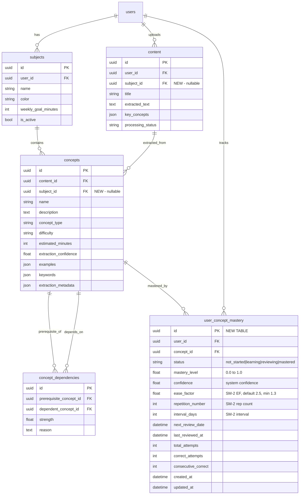

## Deepening + Review Summary

**Deepened:** 2026-03-14 (10 agents). **Reviewed:** 2026-03-14 (simplicity reviewer). All findings incorporated inline below.

### Review Reconciliation (Authoritative)

Where the plan body contradicts the deepening summary or earlier versions, this section is the final word:

1. **UserConceptMastery = 7 columns only.** `id, user_id, concept_id, status, mastery_level, created_at, updated_at`. SM-2 fields (ease_factor, interval_days, etc.) add in Phase 5 migration. Practice fields (total_attempts, correct_attempts) add in Phase 4 migration. Confidence field add when definition is clear.
2. **Ship 3 endpoints, not 8.** `POST /extract`, `GET /subjects/{id}/detail`, dashboard extension. CRUD endpoints (GET/PATCH/DELETE individual concepts) deferred until UI consumers exist.
3. **Phase 2f merged into 2a.** Content-Subject association is a prerequisite for extraction, not a follow-up. The migration already adds `subject_id` to Content.
4. **No velocity sparkline.** Mastery overview shows ring + counts only. Velocity is Phase 5 analytics.
5. **No circular dependency detection.** Dependencies are display-only in Phase 2. Store what Claude returns.
6. **No `ExtractionPartialError`.** Partial success is a normal return (`chunks_failed > 0`). `ExtractionError` for total failure only.
7. **No fingerprint column.** In-memory `normalize_concept_name()` handles Phase 2 dedup.
8. **No `due_for_review` in dashboard.** Always 0 until Phase 5 sets `next_review_date`. Add to dashboard query in Phase 5.
9. **Consolidation pass deferred.** Per-chunk dependency extraction is sufficient for v1. Add cross-chunk consolidation if quality proves insufficient.
10. **Structured Outputs (GA)** replaces response prefill + regex parsing. `output_config.format` with JSON schema.
11. **Prompt caching** on system prompt. `cache_control: {"type": "ephemeral"}`.

---

# feat: Concept Extraction Pipeline — AI-Powered Knowledge Graph

## Overview

Phase 2 of the Study Architect product build. When users upload study materials, Claude API extracts atomic learning concepts structured as Subject-Verb-Object (SVO) learning objectives, stores them with prerequisite relationships in a knowledge graph, and begins tracking per-user mastery. This is the feature that transforms Study Architect from "time tracker with AI chat" into "mastery-based study companion that proves you learned it."

**What ships:** Concept extraction service, concept CRUD API, `user_concept_mastery` table, Subject Detail page, dashboard mastery integration.

**What this enables (future phases):** Practice question generation (Phase 4), SM-2 spaced repetition scheduling (Phase 5), retention curves and analytics (Phase 5).

## Problem Statement

Current state: users upload content, text is extracted and stored, but the system has no understanding of WHAT the content teaches. The `key_concepts` field on Content is populated by naive word-frequency counting (`content.py:315-353`) — not AI analysis. Dashboard shows study TIME but not learning PROGRESS. There's no concept-level mastery, no knowledge gap identification, no "what should I review next."

The gap: without structured concepts, the product can't answer "what do you know?" — only "how long did you study?" That's a timer app, not a learning platform.

## Proposed Solution

Build a concept extraction pipeline that:
1. Takes extracted text from uploaded content
2. Chunks it for processing (existing `extract_chunks()`)
3. Sends chunks to Claude API with a structured SVO extraction prompt
4. Aggregates, deduplicates, and stores concepts + dependency relationships
5. Links concepts to both their source content AND the user's subject
6. Tracks per-user mastery in a new `user_concept_mastery` table
7. Surfaces concepts on a new Subject Detail page
8. Wires aggregate mastery data into the existing dashboard

## Technical Approach

### Architecture

```
Content Upload (existing)
    │
    ▼
Text Extraction (existing ContentProcessor)
    │
    ▼
User triggers extraction ──► ConceptExtractionService
    │                              │
    │                              ├─ Chunk text (extract_chunks)
    │                              ├─ Claude API × N chunks (SVO prompt)
    │                              ├─ Aggregate + deduplicate
    │                              ├─ Infer dependencies
    │                              └─ Bulk insert (ConceptBulkCreate schema)
    │
    ▼
concepts + concept_dependencies tables (exist)
    │
    ▼
user_concept_mastery table (NEW)
    │
    ▼
Subject Detail page + Dashboard mastery metrics
```

**Key decision: extraction is user-triggered, not automatic.** The user explicitly triggers extraction after upload (via Subject Detail page or a "Extract Concepts" action). Rationale:
- Upload stays fast (no 10-30s Claude API delay blocking the response)
- User can review extracted text quality before spending API credits
- User must associate content with a subject first (required for concept organization)
- Failed extraction doesn't break the upload flow
- Future: auto-extraction can be added as an option once reliability is proven

### ERD: New/Modified Tables



### Implementation Phases

#### Phase 2a: Database Foundation

**New model: `UserConceptMastery`** (`backend/app/models/user_concept_mastery.py`)

```python
class MasteryStatus(str, enum.Enum):
    NOT_STARTED = "not_started"
    LEARNING = "learning"
    REVIEWING = "reviewing"
    MASTERED = "mastered"

class UserConceptMastery(Base):
    __tablename__ = "user_concept_mastery"
    __table_args__ = (
        UniqueConstraint("user_id", "concept_id", name="uq_user_concept_mastery"),
        CheckConstraint("mastery_level >= 0.0 AND mastery_level <= 1.0", name="mastery_level_range"),
        CheckConstraint(
            "status IN ('not_started', 'learning', 'reviewing', 'mastered')",
            name="mastery_status_check",
        ),
    )

    id = Column(UUID(as_uuid=True), primary_key=True, default=uuid.uuid4)
    user_id = Column(UUID(as_uuid=True), ForeignKey("users.id", ondelete="CASCADE"), nullable=False)
    concept_id = Column(UUID(as_uuid=True), ForeignKey("concepts.id", ondelete="CASCADE"), nullable=False, index=True)

    status = Column(String(20), nullable=False, default=MasteryStatus.NOT_STARTED)
    mastery_level = Column(Float, nullable=False, default=0.0)

    # SM-2 fields (ease_factor, repetition_number, interval_days, next_review_date) → add in Phase 5 migration
    # Practice fields (total_attempts, correct_attempts, consecutive_correct) → add in Phase 4 migration
    # Confidence field → add when definition is clear (Phase 4/5)

    created_at = Column(DateTime, default=datetime.utcnow, nullable=False)
    updated_at = Column(DateTime, default=datetime.utcnow, onupdate=datetime.utcnow, nullable=False)
```

**Modify existing `Concept` model:** Add `subject_id` column.

```python
# In backend/app/models/concept.py, add:
subject_id = Column(
    UUID(as_uuid=True),
    ForeignKey("subjects.id", ondelete="SET NULL"),
    nullable=True,
    index=True,
)
subject = relationship("Subject")
```

**Modify existing `Content` model:** Add `subject_id` FK and `extraction_status` field.

```python
# In backend/app/models/content.py, add:
subject_id = Column(
    UUID(as_uuid=True),
    ForeignKey("subjects.id", ondelete="SET NULL"),
    nullable=True,
    index=True,
)
subject_ref = relationship("Subject")

# Concept extraction lifecycle (separate from processing_status which tracks text extraction)
extraction_status = Column(
    String(20),
    nullable=True,  # NULL = never extracted
    # Valid: 'extracting', 'completed', 'failed', 'partial'
)
extraction_error = Column(Text, nullable=True)  # Error details on failure
```

**Migration file:** `backend/alembic/versions/XXXX_add_user_concept_mastery_and_subject_fks.py`

- Create `user_concept_mastery` table with all columns, constraints, and indexes
- Add `subject_id` column to `concepts` table (nullable FK to subjects, `ondelete="SET NULL"`)
- Add `subject_id` column to `content` table (nullable FK to subjects, `ondelete="SET NULL"`)
- Add `extraction_status` column to `content` table (nullable String(20))
- Add `extraction_error` column to `content` table (nullable Text)
- **Backfill content.subject_id:** `UPDATE content SET subject_id = (SELECT id FROM subjects WHERE subjects.name = content.subject AND subjects.user_id = content.user_id)`
- **Index strategy (simplified per review):**
  - `uq_user_concept_mastery(user_id, concept_id)` — UNIQUE (also serves as primary lookup)
  - `ix_ucm_concept_id(concept_id)` — reverse lookup
  - `ix_ucm_user_status(user_id, status) WHERE status != 'mastered'` — Subject Detail filtering
  - `ix_concepts_subject_id(subject_id)` on concepts — from `index=True`
  - `ix_content_subject_id(subject_id)` on content — from `index=True`
- **Deferred:** `ix_ucm_user_next_review` — add in Phase 5 when `next_review_date` column exists
- **Do NOT create:** standalone `user_id` index, composite `(user_id, concept_id)`, composite `(subject_id, difficulty)`

**Update `alembic/env.py`:** Add missing model imports:
```python
from app.models.concept import Concept, ConceptDependency
from app.models.user_concept_mastery import UserConceptMastery
```

**New Pydantic schemas:** `backend/app/schemas/mastery.py`

```python
class MasteryResponse(BaseModel):
    id: UUID
    concept_id: UUID
    status: MasteryStatus  # Use enum, not bare str
    mastery_level: float
    confidence: float
    total_attempts: int
    correct_attempts: int
    next_review_date: Optional[datetime]
    last_reviewed_at: Optional[datetime]
    model_config = ConfigDict(from_attributes=True)

class SubjectMasterySummary(BaseModel):
    subject_id: UUID
    subject_name: str
    total_concepts: int
    mastered_count: int
    learning_count: int
    not_started_count: int
    mastery_percentage: float  # mastered / total * 100
    due_for_review: int
```

**Deliverables:**
- [x] `backend/app/models/user_concept_mastery.py` — new model
- [x] `backend/app/models/concept.py` — add `subject_id` column + relationship
- [x] `backend/app/models/content.py` — add `subject_id` FK + relationship
- [x] `backend/alembic/versions/XXXX_add_mastery_and_subject_fks.py` — manual migration
- [x] `backend/alembic/env.py` — add Concept, ConceptDependency, UserConceptMastery imports
- [x] `backend/app/schemas/mastery.py` — mastery response schemas
- [x] `backend/app/schemas/concept.py` — update ConceptCreate to accept optional `subject_id`
- [x] Run migration locally and verify on Neon

---

#### Phase 2b: Concept Extraction Service

**New service:** `backend/app/services/concept_extraction.py`

Core responsibilities:
1. Accept content text + subject_id
2. Chunk text using `content_processor.extract_chunks()`
3. Send each chunk to Claude with SVO extraction prompt
4. Parse structured JSON response
5. Deduplicate concepts across chunks
6. Infer inter-concept dependencies
7. Return list of ConceptCreate + ConceptDependencyCreate objects

**Claude prompt design** (SVO structure per brainstorm research):

```python
EXTRACTION_SYSTEM_PROMPT = """You are a concept extraction engine for an educational platform.
Extract atomic learning concepts from study material as Subject-Verb-Object (SVO) learning objectives.

GOOD concept names (specific, testable):
- "Calculate derivative using chain rule"
- "Implement binary search on sorted array"
- "Differentiate stack vs queue data structures"

BAD concept names (vague, untestable):
- "Understand calculus"
- "Binary search"
- "Data structures"

For each concept, provide:
- name: Clear SVO learning objective (3-10 words)
- description: Concise explanation (1-3 sentences)
- concept_type: definition | procedure | principle | example | application | comparison
- difficulty: beginner | intermediate | advanced | expert
- estimated_minutes: Time to master (5-60 minutes)
- keywords: 3-5 related search terms
- examples: 1-2 example questions testing this concept

Also identify prerequisite dependencies between extracted concepts:
- prerequisite_name: Name of the prerequisite concept
- dependent_name: Name of the concept that depends on it
- strength: 0.0 (loosely related) to 1.0 (absolutely required)
- reason: Brief explanation of why this dependency exists

Return valid JSON matching this exact schema:
{
  "concepts": [
    {
      "name": "...",
      "description": "...",
      "concept_type": "definition",
      "difficulty": "beginner",
      "estimated_minutes": 15,
      "keywords": ["...", "..."],
      "examples": ["...", "..."]
    }
  ],
  "dependencies": [
    {
      "prerequisite_name": "...",
      "dependent_name": "...",
      "strength": 1.0,
      "reason": "..."
    }
  ],
  "metadata": {
    "total_extracted": 0,
    "extraction_confidence": 0.85,
    "notes": "..."
  }
}"""
```

**Parallel chunked extraction with post-hoc deduplication:**

```python
# Module-level singleton (follows ClaudeService, ContentProcessor pattern)
concept_extraction_service = ConceptExtractionService()

class ConceptExtractionService:
    """Extracts atomic learning concepts from content text via Claude API."""

    MAX_CHUNKS = 30        # Security: cap API calls per extraction
    MAX_CONCEPTS = 200     # Security: cap concepts per content item
    MAX_TEXT_LENGTH = 100_000  # Security: cap input text (~25 pages)
    CHUNK_SIZE = 4000
    CHUNK_OVERLAP = 400    # 10% overlap (was 200/5% — increased for boundary coverage)

    async def extract_concepts(
        self,
        content_id: UUID,
        subject_id: UUID,
        extracted_text: str,
        user_id: UUID,
        db: Session,
    ) -> ConceptBulkCreateResponse:
        # Cap text length (security: prevent cost attacks)
        text = extracted_text[:self.MAX_TEXT_LENGTH]

        # 1. Chunk text
        chunks = content_processor.extract_chunks(text, self.CHUNK_SIZE, self.CHUNK_OVERLAP)
        chunks = chunks[:self.MAX_CHUNKS]  # Cap chunks

        # 2. Extract from chunks IN PARALLEL (3 concurrent Claude calls)
        semaphore = asyncio.Semaphore(3)

        async def process_chunk(i: int, chunk: str) -> dict | None:
            async with semaphore:
                try:
                    result = await self._call_claude(chunk, i + 1, len(chunks))
                    return self._parse_and_validate(result)
                except Exception as e:
                    logger.warning(f"Chunk {i+1}/{len(chunks)} failed: {e}")
                    return None  # Partial failure — continue

        tasks = [process_chunk(i, chunk) for i, chunk in enumerate(chunks)]
        results = await asyncio.gather(*tasks)

        # 3. Aggregate + deduplicate (post-hoc, not inline)
        all_concepts = []
        seen_names = set()
        chunks_succeeded = sum(1 for r in results if r is not None)
        for result in results:
            if result is None:
                continue
            for concept in result.get("concepts", []):
                normalized = normalize_concept_name(concept["name"])
                if normalized not in seen_names:
                    all_concepts.append(concept)
                    seen_names.add(normalized)

        # 4. Consolidation pass — send full concept list to Claude for
        #    cross-chunk dependency inference (one lightweight call, ~2s)
        #    Deferred to Phase 2 iteration 2 if extraction quality is sufficient without it.
        #    For v1: dependencies come from per-chunk extraction only.
        dependencies = self._aggregate_dependencies(results)

        # Cap concepts (security)
        all_concepts = all_concepts[:self.MAX_CONCEPTS]

        # 5. ALL DB writes happen here, AFTER all Claude calls complete
        #    (never interleave sync DB ops between async awaits)
        concept_ids = self._bulk_insert(db, all_concepts, dependencies, content_id, subject_id, user_id)

        # 6. Update content status + key_concepts in same transaction
        db.commit()

        return ConceptBulkCreateResponse(
            created_concepts=len(concept_ids),
            created_dependencies=len(dependencies),
            concept_ids=list(concept_ids.values()),
            dependency_ids=[],
            errors=[],
            # Extended fields (from deepening):
            chunks_total=len(chunks),
            chunks_succeeded=chunks_succeeded,
            chunks_failed=len(chunks) - chunks_succeeded,
        )
```

**Claude API call with Structured Outputs** (GA, no SDK needed):

```python
CONCEPT_EXTRACTION_SCHEMA = {
    "type": "object",
    "properties": {
        "concepts": {
            "type": "array",
            "items": {
                "type": "object",
                "properties": {
                    "name": {"type": "string", "description": "SVO learning objective (3-10 words)"},
                    "description": {"type": "string"},
                    "concept_type": {"type": "string", "enum": ["definition", "procedure", "principle", "example", "application", "comparison"]},
                    "difficulty": {"type": "string", "enum": ["beginner", "intermediate", "advanced", "expert"]},
                    "estimated_minutes": {"type": "integer"},
                    "keywords": {"type": "array", "items": {"type": "string"}},
                    "examples": {"type": "array", "items": {"type": "string"}},
                },
                "required": ["name", "description", "concept_type", "difficulty", "estimated_minutes", "keywords", "examples"],
                "additionalProperties": False,
            },
        },
        "dependencies": {
            "type": "array",
            "items": {
                "type": "object",
                "properties": {
                    "prerequisite_name": {"type": "string"},
                    "dependent_name": {"type": "string"},
                    "strength": {"type": "number"},
                    "reason": {"type": "string"},
                },
                "required": ["prerequisite_name", "dependent_name", "strength", "reason"],
                "additionalProperties": False,
            },
        },
        "metadata": {
            "type": "object",
            "properties": {
                "total_extracted": {"type": "integer"},
                "extraction_confidence": {"type": "number"},
                "notes": {"type": "string"},
            },
            "required": ["total_extracted", "extraction_confidence", "notes"],
            "additionalProperties": False,
        },
    },
    "required": ["concepts", "dependencies", "metadata"],
    "additionalProperties": False,
}

async def _call_claude(self, chunk_text: str, chunk_num: int, total_chunks: int) -> dict:
    """Call Claude with Structured Outputs — guaranteed valid JSON, no parsing needed."""
    # Build payload with output_config.format (GA, raw httpx compatible)
    payload = {
        "model": os.getenv("CLAUDE_EXTRACTION_MODEL", os.getenv("CLAUDE_MODEL", "claude-sonnet-4-6")),
        "max_tokens": 4096,
        "temperature": 0.15,  # Low for deterministic extraction
        "system": [
            {
                "type": "text",
                "text": EXTRACTION_SYSTEM_PROMPT,
                "cache_control": {"type": "ephemeral"},  # Prompt caching: 85% savings on chunks 2-N
            }
        ],
        "messages": [
            {"role": "user", "content": f"Extract concepts from this study material (section {chunk_num}/{total_chunks}):\n\n{chunk_text}"}
        ],
        "output_config": {
            "format": {
                "type": "json_schema",
                "schema": CONCEPT_EXTRACTION_SCHEMA,
            }
        },
    }
    # Use httpx directly (not claude_service.chat_completion — needs output_config support)
    async with httpx.AsyncClient(timeout=httpx.Timeout(90.0, connect=5.0)) as client:
        response = await client.post(
            f"{claude_service.base_url}/messages",
            headers=claude_service._get_headers(),
            json=payload,
        )
        if response.status_code == 429:
            retry_after = int(response.headers.get("retry-after", 5))
            await asyncio.sleep(retry_after)
            response = await client.post(  # Retry once
                f"{claude_service.base_url}/messages",
                headers=claude_service._get_headers(),
                json=payload,
            )
        response.raise_for_status()
        data = response.json()
    # Structured outputs guarantees valid JSON — just parse
    return json.loads(data["content"][0]["text"])
```

**Note:** This bypasses `claude_service.chat_completion()` because that method doesn't support `output_config`. The extraction service uses `claude_service` for headers/base_url but makes the HTTP call directly. Future refactor: add `output_config` support to `ClaudeService`.

**Concept name normalization** (for better deduplication):

```python
def normalize_concept_name(name: str) -> str:
    normalized = name.strip().lower()
    normalized = re.sub(r'\s+', ' ', normalized)  # Collapse whitespace
    normalized = re.sub(r'\b(the|a|an|of|in|on|for|to|and|vs|versus)\b', '', normalized)
    return re.sub(r'\s+', ' ', normalized).strip()
```

**Pydantic validation** (defense-in-depth even with structured outputs):

```python
def _validate_concepts(self, parsed: dict) -> dict:
    """Validate extracted concepts through Pydantic schemas.
    With structured outputs, JSON is guaranteed valid.
    This catches business logic issues (empty names, etc.)."""
    validated = []
    for c in parsed.get("concepts", []):
        try:
            ConceptBase(**c)  # Validates name length, type enum, difficulty enum, etc.
            validated.append(c)
        except ValidationError:
            continue  # Skip concepts that fail business validation
    parsed["concepts"] = validated
    return parsed
```

**Bulk insert with SQLAlchemy Core** (3 round-trips instead of 75):

```python
def _bulk_insert(self, db, concepts_data, dependencies_data, content_id, subject_id, user_id):
    from sqlalchemy import insert

    # 1. Bulk insert concepts
    concept_records = [{
        "id": uuid.uuid4(), "name": c["name"], "description": c["description"],
        "concept_type": c.get("concept_type", "definition"),
        "difficulty": c.get("difficulty", "beginner"),
        "estimated_minutes": c.get("estimated_minutes", 15),
        "content_id": content_id, "subject_id": subject_id,
        "keywords": c.get("keywords"), "examples": c.get("examples"),
        "extraction_confidence": c.get("extraction_confidence"),
        "created_at": datetime.utcnow(), "updated_at": datetime.utcnow(),
    } for c in concepts_data]

    if concept_records:
        db.execute(insert(Concept).values(concept_records))

    concept_ids = {r["name"]: r["id"] for r in concept_records}

    # 2. Bulk insert dependencies (resolve names to IDs)
    # 3. Bulk insert mastery records (status=not_started for each concept)
    mastery_records = [{
        "id": uuid.uuid4(), "user_id": user_id, "concept_id": cid,
        "status": "not_started", "mastery_level": 0.0,
        "created_at": datetime.utcnow(), "updated_at": datetime.utcnow(),
    } for cid in concept_ids.values()]

    if mastery_records:
        db.execute(insert(UserConceptMastery).values(mastery_records))

    return concept_ids
```

**ExtractionError as plain Exception** (not HTTPException — service layer):

```python
# In concept_extraction.py (NOT in core/exceptions.py)
class ExtractionError(Exception):
    """Raised when ALL chunks fail. Partial success is a normal return (chunks_failed > 0)."""
    pass
```

**Error handling and resilience:**
- If a chunk fails, continue with remaining chunks (partial extraction > no extraction)
- Track chunk success/failure counts in response (`chunks_succeeded`, `chunks_failed`)
- If ALL chunks fail, mark content `extraction_status = 'failed'` with error details
- Retry once on timeout per chunk (same chunk, not smaller — transient load is most common cause)
- Frontend shows differentiated toast: "Extracted 15 concepts from 7/10 sections. 3 sections failed."
- **All DB writes happen AFTER all Claude calls complete** — never interleave sync DB ops between async awaits (connection pool exhaustion risk)
- Dependencies are informational (display-only) in Phase 2. Store whatever Claude returns. Cycle detection deferred to Phase 5 when learning paths enforce prerequisite ordering.

**Deliverables:**
- [x] `backend/app/services/concept_extraction.py` — extraction service with Claude prompt, chunking, dedup, dependency resolution (includes `ExtractionError` as plain Exception — NOT in core/exceptions.py)
- [ ] `backend/app/core/exceptions.py` — add `ConceptNotFoundError` only (ExtractionError lives in the service module)
- [x] Tests: `backend/tests/test_concept_extraction.py` — unit tests with mocked Claude responses
- [ ] Tests: `backend/tests/test_concept_extraction_integration.py` — integration tests with real (small) content

---

#### Phase 2c: API Endpoints

**New router:** `backend/app/api/v1/concepts.py`

```
POST   /api/v1/concepts/extract           ← Trigger extraction for a content item
GET    /api/v1/subjects/{id}/detail       ← Subject + concepts + mastery (consolidated)
GET    /api/v1/dashboard/                 ← Extended with mastery fields (existing endpoint)

# Deferred (build when UI consumers exist):
# GET    /api/v1/concepts/               ← Global concept list (no UI in Phase 2)
# GET    /api/v1/concepts/{id}           ← Concept detail (no detail view in Phase 2)
# PATCH  /api/v1/concepts/{id}           ← Edit concept (no edit UI in Phase 2; re-extract covers bad concepts)
# DELETE /api/v1/concepts/{id}           ← Delete concept (re-extract covers this)
# GET    /api/v1/concepts/{id}/graph     ← Knowledge graph (Phase 5 visualization)
```

**Extraction endpoint with concurrency guard:**

```python
@router.post("/extract", response_model=ConceptBulkCreateResponse)
@limiter.limit("5/minute")  # Per-IP. Also add per-user: 50/day in Redis
async def extract_concepts(
    request: Request,
    extraction_request: ConceptExtractionRequest,
    current_user: User = Depends(get_current_user),
    db: Session = Depends(get_db),
):
    # 1. Verify content belongs to user (return 404, never 403)
    content = db.query(Content).filter(
        Content.id == extraction_request.content_id,
        Content.user_id == current_user.id,
    ).first()
    if not content:
        raise HTTPException(404, "Content not found")

    # 2. Verify subject belongs to user (return 404, never 403)
    subject = db.query(Subject).filter(
        Subject.id == extraction_request.subject_id,
        Subject.user_id == current_user.id,
    ).first()
    if not subject:
        raise HTTPException(404, "Subject not found")

    # 3. Check content has extracted text
    if content.processing_status != "completed" or not content.extracted_text:
        raise HTTPException(400, "Content text not yet extracted")

    # 4. Concurrency guard: conditional UPDATE (prevents double-click race)
    rows = db.execute(
        update(Content)
        .where(Content.id == content.id, Content.extraction_status != "extracting")
        .values(extraction_status="extracting")
    ).rowcount
    db.flush()
    if rows == 0:
        raise HTTPException(409, "Extraction already in progress")

    # 5. Handle re-extraction
    if extraction_request.force_reextract:
        # Delete existing concepts (CASCADE deletes mastery + dependencies)
        db.query(Concept).filter(Concept.content_id == content.id).delete()
        db.flush()

    # 6. Call extraction service
    try:
        result = await concept_extraction_service.extract_concepts(
            content.id, subject.id, content.extracted_text, current_user.id, db
        )
        content.extraction_status = "completed" if not result.chunks_failed else "partial"
        content.key_concepts = [c.name for c in result.concept_ids]  # Update legacy field
        db.commit()
        return result
    except ExtractionError as e:
        content.extraction_status = "failed"
        content.extraction_error = str(e)
        db.commit()
        raise HTTPException(502, f"Extraction failed: {e}")
```

**Subject concepts endpoint (for Subject Detail page):**

```python
@router.get("/subjects/{subject_id}/concepts")
@limiter.limit("30/minute")
async def get_subject_concepts(
    request: Request,
    subject_id: UUID,
    current_user: User = Depends(get_current_user),
    db: Session = Depends(get_db),
):
    # 1. Verify subject belongs to user
    # 2. Query concepts WHERE subject_id = subject_id
    # 3. LEFT JOIN user_concept_mastery for current user
    # 4. Return concepts with mastery data
```

**Integration points:**
- Register router in `backend/app/api/v1/api.py`
- Add `/api/v1/concepts/` to `jwt_protected_paths` in `csrf.py`
- Import `limiter` from `app.core.rate_limiter` (NOT `shared_limiter`)

**New schema:** `ConceptExtractionRequest`
```python
class ConceptExtractionRequest(BaseModel):
    content_id: UUID
    subject_id: UUID
    force_reextract: bool = False  # If true, deletes existing concepts first
```

**New schema:** `ConceptWithMastery`
```python
class ConceptWithMastery(ConceptResponse):
    mastery: Optional[MasteryResponse] = None  # None if no mastery record yet
```

**Deliverables:**
- [x] `backend/app/api/v1/concepts.py` — router with all endpoints
- [x] `backend/app/api/v1/api.py` — register concepts router
- [x] `backend/app/core/csrf.py` — add concepts to exempt paths
- [x] `backend/app/schemas/concept.py` — add `ConceptExtractionRequest`, `ConceptWithMastery`
- [x] Tests: `backend/tests/test_concepts_api.py` — endpoint tests
- [x] Verify endpoints on local and Neon after deploy

---

#### Phase 2d: Frontend — Subject Detail Page

**New page:** `frontend/src/pages/SubjectDetailPage.tsx`
**Route:** `/subjects/:id`

**Layout** (based on Stitch v3 Subject Detail design):
```
┌─────────────────────────────────────────────────┐
│  ← Back to Dashboard    [Subject Name]   [Edit] │
├─────────────────────────────────────────────────┤
│                                                  │
│  ┌──────────────────────────────────────────────┐ │
│  │ Mastery Overview                              │ │
│  │ ██████░░ 62%        15/24 concepts mastered   │ │
│  │ 3 learning | 6 not started                    │ │
│  └──────────────────────────────────────────────┘ │
│                                                  │
│  ┌──────────────────────────────────────────────┐│
│  │ Content Items (3)              [Extract All] ││
│  │ ┌─ Chapter 1.pdf ──── 8 concepts ── ✓ ──┐  ││
│  │ ├─ Lecture 3.pptx ── 12 concepts ── ✓ ──┤  ││
│  │ └─ Notes.md ──────── pending ── [Extract]┘  ││
│  └──────────────────────────────────────────────┘│
│                                                  │
│  ┌──────────────────────────────────────────────┐│
│  │ Concepts (24)           Filter: [All ▾]      ││
│  │                                               ││
│  │ ● Define stack vs queue    ██████████ 95%    ││
│  │   definition | beginner | 10 min             ││
│  │                                               ││
│  │ ● Implement BFS traversal ████░░░░░░ 40%    ││
│  │   procedure | intermediate | 25 min          ││
│  │                                               ││
│  │ ○ Analyze time complexity  ░░░░░░░░░░ 0%     ││
│  │   principle | advanced | 30 min              ││
│  │   ⚠ Requires: Define Big-O notation          ││
│  └──────────────────────────────────────────────┘│
└─────────────────────────────────────────────────┘
```

**Components:**
- `SubjectDetailPage.tsx` — page with TanStack Query data fetching
- `SubjectMasteryOverview.tsx` — mastery ring/bar + concept counts
- `SubjectConceptList.tsx` — filterable concept list with mastery indicators
- `ConceptCard.tsx` — individual concept with type badge, difficulty, mastery bar
- `ExtractionTrigger.tsx` — button/dialog to trigger concept extraction
- `ContentExtractionStatus.tsx` — shows extraction status per content item

**TypeScript types** (new file: `frontend/src/types/concept.ts`):
```typescript
export interface ConceptResponse {
  id: string
  content_id: string
  name: string
  description: string
  concept_type: 'definition' | 'procedure' | 'principle' | 'example' | 'application' | 'comparison'
  difficulty: 'beginner' | 'intermediate' | 'advanced' | 'expert'
  estimated_minutes: number
  examples: string[] | null
  keywords: string[] | null
  extraction_confidence: number | null
  created_at: string
  updated_at: string
}

export interface MasteryData {
  id: string
  concept_id: string
  status: 'not_started' | 'learning' | 'reviewing' | 'mastered'
  mastery_level: number // 0.0 to 1.0
  total_attempts: number
  correct_attempts: number
  next_review_date: string | null
  last_reviewed_at: string | null
}

export interface ConceptWithMastery extends ConceptResponse {
  mastery: MasteryData | null  // null, not undefined (JSON serialization)
}

export interface SubjectDetailData {
  subject: { id: string; name: string; color: string }
  concepts: ConceptWithMastery[]
  mastery_summary: {
    total_concepts: number
    mastered_count: number
    learning_count: number
    not_started_count: number
    mastery_percentage: number  // 0-100
    due_for_review: number
  }
}
```

**Data fetching pattern** (single query, following DashboardPage pattern):
```typescript
// Single consolidated endpoint — not 3 separate queries
// Avoids waterfall rendering and stale-cache inconsistency
const { data, isLoading } = useQuery<SubjectDetailData>({
  queryKey: ['subject-detail', subjectId],
  queryFn: () => api.get(`/api/v1/subjects/${subjectId}/detail`).then(r => r.data),
  staleTime: 5 * 60 * 1000,     // 5 min — concepts change only on explicit mutations
  gcTime: 30 * 60 * 1000,       // 30 min cache
  refetchOnWindowFocus: false,
  enabled: !!subjectId,          // Don't fire with undefined param
});
```

**Extraction trigger mutation** (matches consolidated query pattern):
```typescript
const extractMutation = useMutation({
  mutationFn: (req: { content_id: string; subject_id: string; force_reextract?: boolean }) =>
    api.post('/api/v1/concepts/extract', req).then(r => r.data),
  onSuccess: (data) => {
    queryClient.invalidateQueries({ queryKey: ['subject-detail', subjectId] });
    queryClient.invalidateQueries({ queryKey: ['dashboard'] });
    const msg = data.chunks_failed
      ? `Extracted ${data.created_concepts} concepts from ${data.chunks_succeeded}/${data.chunks_total} sections.`
      : `Extracted ${data.created_concepts} concepts successfully.`;
    toast.success(msg);
  },
  onError: (err: AxiosError<{ detail: string }>) => {
    toast.error(err.response?.data?.detail ?? 'Extraction failed. Please try again.');
  },
});
```

**Navigation:** Add Subject Detail to router, link from SubjectList cards on dashboard.

**shadcn components needed** (add one at a time):
- `badge` — concept type/difficulty badges
- `tooltip` — hover details on mastery bars
- Mastery bars: CSS-only `div` with width transition (not shadcn `<Progress>` — avoids rAF contention at 50 instances)
- Mastery ring: custom SVG `circle` with `stroke-dashoffset` (not available from shadcn)
- Section spacing: `space-y-6` (not `<Separator>` — matches dashboard pattern)
- Status feedback: `toast` from sonner (already installed, not `<Alert>`)

**Deliverables:**
- [x] `frontend/src/types/concept.ts` — TypeScript interfaces with union literal types (not bare string)
- [x] `frontend/src/pages/SubjectDetailPage.tsx` — with `useParams` validation + 404 state
- [x] `frontend/src/components/subject-detail/SubjectMasteryOverview.tsx` — includes custom SVG mastery ring (circular progress — not available from shadcn)
- [ ] `frontend/src/components/subject-detail/SubjectConceptList.tsx` — with CSS-only mastery bars (not shadcn `<Progress>`)
- [x] `frontend/src/components/subject-detail/ConceptCard.tsx` — mastery-to-color mapping: mastered=primary, learning=secondary, not_started=muted
- [x] `frontend/src/components/subject-detail/ExtractionTrigger.tsx` — with `isPending` loading state, disabled during extraction, `AxiosError.response?.data?.detail` for errors
- [ ] `frontend/src/components/subject-detail/ContentExtractionStatus.tsx`
- [ ] `frontend/src/components/subject-detail/index.ts` — barrel export
- [x] Route: `/subjects/:id` in App.tsx with `useParams` + undefined guard
- [x] SubjectList cards link to Subject Detail
- [x] Add shadcn components one at a time: badge, tooltip (drop separator — use spacing per dashboard pattern)
- [ ] Responsive layout (desktop-first, readable on mobile)
- [x] Backend: `GET /api/v1/subjects/{id}/detail` — consolidated endpoint returning subject + concepts with mastery + summary

---

#### Phase 2e: Dashboard Mastery Integration

**Wire real mastery data into existing HeroMetrics component.**

Currently `HeroMetrics.tsx:6-9` accepts optional `masteryIndex` and `dueForReview` props, showing `--` as placeholder.

**New dashboard endpoint fields** (extend existing `GET /api/v1/dashboard/`):
```python
# Add to dashboard response:
mastery_index: Optional[float]  # Weighted average mastery across all subjects (0-100)
due_for_review: int  # Concepts past next_review_date
total_concepts: int  # All concepts across all subjects
mastered_concepts: int  # Concepts with status='mastered'
```

**Dashboard query addition** (add as 4th focused query, not modify existing 3):
```python
# Query 4: Concept mastery summary
# Use count-based %, NOT func.avg(mastery_level) — avg drags near zero
# when most concepts are not_started (psychologically defeating)
mastery_stats = db.execute(
    select(
        func.count(UserConceptMastery.id).label("total"),
        func.count(case((UserConceptMastery.status == "mastered", 1))).label("mastered"),
    ).where(UserConceptMastery.user_id == user.id)
).first()

# Mastery index = mastered_count / total_count * 100
# due_for_review: add in Phase 5 when next_review_date column exists
mastery_index = (
    (mastery_stats.mastered / mastery_stats.total * 100)
    if mastery_stats.total > 0
    else None  # None = no concepts yet, frontend shows "--"
)
```

**Subject mastery % in SubjectList:** Currently SubjectList shows time-based progress. Add mastery % per subject from concepts data.

**Deliverables:**
- [x] `backend/app/api/v1/dashboard.py` — add mastery query (4th query)
- [ ] `backend/app/schemas/dashboard.py` — add mastery fields to response
- [x] `frontend/src/components/dashboard/HeroMetrics.tsx` — wire real mastery data
- [ ] `frontend/src/components/dashboard/SubjectList.tsx` — show mastery % per subject
- [ ] Test: dashboard still works with 0 concepts (graceful empty state)

---

#### Phase 2f: Content-Subject Association

**Allow users to associate uploaded content with subjects** (required for concept extraction).

Currently content upload doesn't take a `subject_id`. Two approaches:
1. Add `subject_id` to content upload form (optional field)
2. Associate content with subjects from Subject Detail page ("Add content to this subject")

**Implement both:**
- Content upload form: optional subject dropdown selector
- Subject Detail page: "Link Content" action to associate existing unlinked content

**Backend:**
```python
# Update content upload to accept optional subject_id
# PATCH /api/v1/content/{id} already exists — add subject_id to ContentUpdate schema

class ContentUpdate(BaseModel):
    # ... existing fields ...
    subject_id: Optional[UUID] = None
```

**Frontend (ContentUpload):** This is a MUI component (Phase 3 restyle). For now, add a minimal subject selector to the existing upload flow. Can be a simple dropdown using the existing subjects API.

**Deliverables:**
- [x] `backend/app/schemas/content.py` — add `subject_id` to ContentUpdate
- [ ] `backend/app/api/v1/content.py` — handle `subject_id` in upload and update
- [ ] Frontend: subject selector in content upload (minimal, MUI-compatible for now)
- [ ] Frontend: "Link Content" action on Subject Detail page

---

## Alternative Approaches Considered

### 1. Automatic extraction on upload (rejected)
Extraction runs inline during upload. Rejected because:
- Blocks upload response for 10-30s (poor UX)
- User can't review text quality first
- Failed extraction breaks the upload flow
- No subject association at upload time

### 2. Background task queue (deferred)
Use Celery/Redis queue for async extraction. Deferred because:
- Adds infrastructure complexity (task broker)
- Current scale doesn't warrant it (< 100 users)
- The manual trigger approach is simpler and sufficient
- Can be added later when extraction volume grows

### 3. Anthropic SDK instead of raw httpx (deferred — less urgent now)
The SDK provides tool_use for guaranteed structured output. Deferred because:
- **Structured Outputs (`output_config.format`) are now GA** and work with raw httpx — no SDK needed for guaranteed JSON
- Current codebase uses raw httpx consistently
- The extraction service uses structured outputs directly via httpx (see Phase 2b)
- SDK migration can be a separate refactor (all AI services at once) but is no longer blocking

### 4. OpenAI fallback for extraction (deferred)
Claude primary, OpenAI fallback. Deferred for extraction because:
- Extraction quality is critical — inconsistent models produce inconsistent concept graphs
- OpenAI prompt compatibility needs separate testing
- Better to have reliable extraction from one model than unreliable from two
- Chat fallback pattern doesn't apply to structured extraction

## System-Wide Impact

### Interaction Graph

```
User triggers extraction
  → POST /api/v1/concepts/extract
    → ConceptExtractionService.extract_concepts()
      → content_processor.extract_chunks() (existing)
      → ClaudeService._call_claude() × N chunks (new method)
      → Concept bulk insert (existing schema)
      → UserConceptMastery bulk insert (new)
      → Content.key_concepts updated (existing field)
    → Response: ConceptBulkCreateResponse
  → TanStack Query invalidation (subject-concepts, subject-mastery, dashboard)
    → Dashboard re-renders with mastery data
    → Subject Detail re-renders with concept list
```

### Error & Failure Propagation

| Error | Source | Handling |
|-------|--------|----------|
| Claude API timeout | httpx 60s timeout | Retry once with smaller chunk, then fail chunk |
| Claude API rate limit | 429 response | Exponential backoff, fail after 3 retries |
| Claude returns invalid JSON | Parse failure | Log response, mark chunk as failed, continue |
| Partial extraction (some chunks fail) | Mixed | Store what succeeded, report failures in metadata |
| DB constraint violation | Duplicate concept name | Skip duplicate, log warning |
| Content not found / not owned | Auth check | 404 (never 403 — don't leak existence) |
| No extracted text | Content not processed | 400 with clear message |
| Subject not found / not owned | Auth check | 404 (never 403 — don't leak existence) |
| Extraction already in progress | Concurrency guard | 409 Conflict |

### State Lifecycle Risks

- **Partial extraction failure:** If extraction fails after some concepts are stored, the content has partial concepts. Mitigated by: extraction_metadata tracks chunk success/failure, re-extraction with `force_reextract=true` deletes old concepts and starts fresh.
- **Re-extraction orphans mastery data:** If concepts are deleted during re-extraction, associated UserConceptMastery records are CASCADE deleted. This is intentional — mastery of deleted concepts is meaningless.
- **Concurrent extraction:** Two simultaneous extraction requests for the same content could create duplicate concepts. Mitigated by: check for existing concepts before extraction, return 409 if extraction already in progress.

### API Surface Parity

New endpoints follow existing patterns:
- Auth: `Depends(get_current_user)` — same as subjects, sessions, dashboard
- Rate limiting: `@limiter.limit()` — same pattern, tighter limit for extraction
- CSRF: added to `jwt_protected_paths` — same as other JWT endpoints
- Response format: Pydantic v2 schemas with `ConfigDict(from_attributes=True)` — same pattern
- Error handling: Custom exceptions extending `BaseAPIException` — same pattern

### Integration Test Scenarios

1. **Full extraction flow:** Upload content → associate with subject → trigger extraction → verify concepts in DB → verify mastery records created → verify dashboard shows mastery data
2. **Re-extraction:** Extract concepts → verify N concepts → re-extract with force → verify old concepts deleted → verify new concepts stored → verify old mastery records CASCADE deleted
3. **Concurrent extraction prevention:** Start extraction → immediately trigger second extraction for same content → verify 409 response
4. **Empty content:** Upload content with no extractable text → trigger extraction → verify graceful 400 response (not 500)
5. **Cross-user isolation:** User A extracts concepts → User B queries same content_id → verify 404 (not User A's concepts)

## Acceptance Criteria

### Functional Requirements

- [x] User can trigger concept extraction for uploaded content via API
- [ ] Extraction produces atomic SVO learning objectives (not vague topic names)
- [x] Concepts are linked to both content (source) and subject (organization)
- [ ] Prerequisite dependencies between concepts are identified and stored
- [x] UserConceptMastery records are created automatically (status=not_started)
- [x] Subject Detail page displays concepts with mastery indicators
- [x] Dashboard shows aggregate mastery index and due-for-review count
- [ ] User can edit extracted concepts (name, description, type, difficulty)
- [ ] User can delete extracted concepts
- [x] Re-extraction deletes old concepts and starts fresh
- [x] Content can be associated with a subject (upload form or Subject Detail)
- [x] Extraction handles large documents (chunked processing, deduplication)
- [x] Partial extraction failure stores what succeeded and reports what failed

### Non-Functional Requirements

- [ ] Extraction of a 10-page PDF completes within 60 seconds
- [ ] Subject Detail page loads concepts in < 500ms (with proper indexes)
- [ ] Dashboard mastery query adds < 50ms to existing dashboard load
- [x] Extraction endpoint rate-limited to 5/minute per user
- [x] All concept data is user-scoped (no cross-user leakage)

### Quality Gates

- [x] Backend tests: concept extraction service unit tests with mocked Claude
- [x] Backend tests: concept API endpoint tests (CRUD + extraction)
- [ ] Backend tests: dashboard mastery query tests (with and without concepts)
- [x] Frontend: Subject Detail page renders with 0 concepts (empty state)
- [ ] Frontend: Subject Detail page renders with 50+ concepts (performance)
- [x] Migration tested on local PostgreSQL AND Neon production
- [ ] `ruff check app/` passes
- [x] `npm run typecheck && npm run lint` passes
- [x] All existing tests still pass (no regressions)

## Success Metrics

| Metric | Target | How to Measure |
|--------|--------|----------------|
| Concept extraction accuracy | > 80% relevant concepts | Manual review of extraction on 5 sample documents |
| Extraction coverage | > 70% of key topics identified | Compare extracted concepts to document table of contents |
| SVO quality | > 90% of concepts follow SVO format | Spot-check: "Can this be tested with a practice question?" |
| Dashboard mastery loads | < 100ms additional latency | Backend timing logs |
| User engagement | Users view Subject Detail page | PostHog event tracking (future) |

## Dependencies & Prerequisites

| Dependency | Status | Risk |
|------------|--------|------|
| `concepts` + `concept_dependencies` tables | Migrated (exists) | None |
| Claude API key configured | Deployed | None — already working for chat |
| Content text extraction working | Deployed | None — ContentProcessor is live |
| Subjects CRUD working | Deployed | None — session 8 shipped this |
| TanStack Query + Tailwind v4 + shadcn | Deployed | None — dashboard uses these |
| Local PostgreSQL for migration dev | Available (port 5433) | Must be running |
| Neon direct connection for migration deploy | Available | Use non-pooled URL |

## Risk Analysis & Mitigation

| Risk | Probability | Impact | Mitigation |
|------|-------------|--------|------------|
| Claude extracts low-quality concepts | Medium | High | SVO prompt engineering, confidence scoring, user can edit/delete |
| Large documents exceed Claude context window | Low | Medium | Chunking with 4000-char chunks, overlap for continuity |
| Extraction takes too long (> 60s) | Medium | Medium | Smaller chunks, timeout per chunk, partial results on failure |
| Concept deduplication across chunks is imperfect | Medium | Low | Name-based dedup + user can merge/delete duplicates |
| Migration breaks existing data | Low | High | Manual migration, tested on local first, concepts tables are empty |
| Subject Detail page performance with many concepts | Low | Medium | Pagination, virtual scrolling for 100+ concepts |
| Claude API cost for heavy extraction usage | Medium | Low | Rate limiting (5/min), monitor usage in Anthropic dashboard |

## Future Considerations

- **Phase 4 integration:** Practice questions generated from extracted concepts
- **Phase 5 integration:** SM-2 scheduling uses `user_concept_mastery` fields (ease_factor, interval_days, next_review_date)
- **Knowledge graph visualization:** Use existing `ConceptGraph` schema + visx for graph rendering
- **Batch extraction:** Extract concepts from all content in a subject at once
- **Cross-content deduplication:** Same concept appearing in multiple documents → merge into one
- **Concept quality scoring:** Track which concepts produce useful practice questions
- **Anthropic SDK migration:** Move all AI services from raw httpx to official SDK (tool_use for guaranteed structured output)
- **Auto-extraction option:** User preference to auto-extract on upload (after reliability is proven)

## Documentation Plan

After implementation:
- [ ] Update `docs/technical/IMPLEMENTATION_STATUS.md` — mark Phase 2 as complete
- [ ] Update CLAUDE.md — add concept endpoints, new patterns
- [x] Update project MEMORY.md — record Phase 2 completion
- [x] Compound document if novel patterns discovered

## Sources & References

### Origin

- **Brainstorm document:** [docs/brainstorms/2026-03-13-mvp-frontend-brainstorm.md](docs/brainstorms/2026-03-13-mvp-frontend-brainstorm.md) — Phase 2 sections (lines 232-235, 342-344). Key decisions: SVO extraction format, concept + mastery tables, Subject Detail as first consumer, progressive feature rendering.

### Internal References

- Concept model: `backend/app/models/concept.py:55-197`
- Concept schemas (full): `backend/app/schemas/concept.py:1-279`
- ClaudeService.analyze_content: `backend/app/services/claude_service.py:211-287`
- Content upload pipeline: `backend/app/api/v1/content.py:165-380`
- Current naive keywords: `backend/app/api/v1/content.py:315-353` (to be replaced)
- ContentProcessor.extract_chunks: `backend/app/services/content_processor.py:322-367`
- Dashboard patterns: `backend/app/api/v1/dashboard.py`
- HeroMetrics placeholders: `frontend/src/components/dashboard/HeroMetrics.tsx:6-9`
- JWT exempt paths: `backend/app/core/csrf.py:243-252`
- Rate limiter: `backend/app/core/rate_limiter.py:1-4`
- Router registration: `backend/app/api/v1/api.py:1-32`
- Alembic model imports: `backend/alembic/env.py:33-38`

### Research References

- SM-2 + FIRe + concept extraction research: `~/.claude/projects/.../memory/sm2-fire-mastery-research.md`
- Institutional learnings: `docs/solutions/integration-issues/full-product-build-mui-to-tailwind-migration.md`
- Session 8 fixes: `~/.claude/projects/.../memory/session8-ci-and-deploy-fixes.md`

### External References

- SVO learning objectives: [ACM DL — Atomic Learning Objectives](https://dl.acm.org/doi/10.1145/3706468.3706550)
- Concept extraction with LLMs: [MDPI — Knowledge Extraction](https://www.mdpi.com/2504-4990/7/3/103)
- MathAcademy FIRe algorithm: [Justin Skycak — Hierarchical Spaced Repetition](https://www.justinmath.com/individualized-spaced-repetition-in-hierarchical-knowledge-structures/)
- SM-2 algorithm: [SuperMemo — SM-2 Documentation](https://super-memory.com/english/ol/sm2.htm)

### Institutional Learnings Applied

| Learning | Source | How Applied |
|----------|--------|-------------|
| Never use `func.timezone()` | Session 8 | Dashboard mastery query uses Python timezone computation |
| Import `limiter` not `shared_limiter` | Session 8 | All concept endpoints import correctly |
| Add JWT paths to CSRF exempt list | Migration history | Concept paths added to `jwt_protected_paths` |
| Enum case must match in WHERE clauses | Session 8 | MasteryStatus uses lowercase strings matching CHECK constraint |
| UUID types in schemas | Session 8 | All new schemas use `uuid.UUID` with `ConfigDict` |
| Manual migration for constraints | Session 8 | Migration written by hand, not autogenerated |
| Test on Neon after deploy | Session 8 | Explicit acceptance criterion |
| shadcn add one at a time | Session 8 | Each component added individually |
| Never cache Claude model IDs | Memory | Model loaded from env var at runtime |
